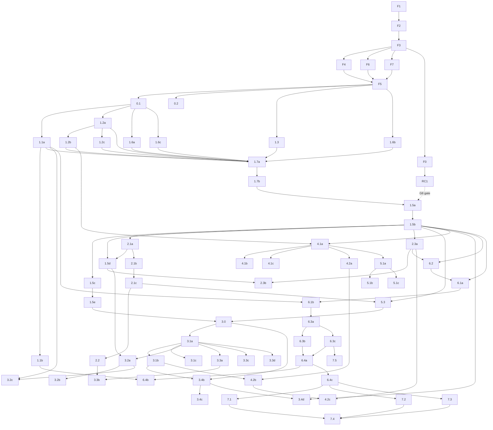

# RamRPG Execution Plan v3 - Orchestrator Runbook

Author: planning architect (read-only session, 2026-09-12). **v3 applies PLAN_REVIEW.md in full** -
the original 33 findings (6 BLOCKERs, 13 MAJORs, 14 minors) plus the v2 re-check (N1-N7). See the
two Changelog sections at the bottom.
Consumer: **Claude Fable** (orchestrator). Fable dispatches subagents; Fable never writes code.
Source of truth: `C:\repos\RamRPG\RAMRPG_ROADMAP_PROMPT.md` (phases 0-7, rules 1-8, DoD).
Audits: `docs/planning/ramrpg-audit.md`, `docs/planning/ramcore-audit.md`, `docs/planning/PLAN_REVIEW.md`.

---

## A. Grand goal and definition of done

**Grand goal.** RamRPG becomes a data-driven RPG platform on top of RamCore: RamRPG owns *RPG
semantics* (stats, skills, items, combat, progression, crafting, perks, mobs); RamCore owns *plumbing*
(loot, objectives, rewards, cooldowns, menus, scheduling, persistence, regions, parties, encounters,
NPCs, displays, real-time scheduling, world instances). Every gameplay behaviour is expressed as a
`dev.willram.ramrpg.api.effects.Effect` bundle, and every piece of content is authorable in HOCON.

**Definition of done (from the roadmap):**

1. No RPG-side duplicates of loot, rewards, objectives, cooldowns, or menu plumbing remain.
2. A new item, enchant, recipe, set, perk, buff, affix, or mob can be added with a `.conf` file and
   `/rpg reload`, with validation errors pointing at file **and** path.
3. A player can: craft a tiered weapon, upgrade and reforge it at a smithing station, enchant it,
   brew a potion that buffs them, spend perk points into a build, equip a 4-piece set, and kill an
   affixed elite and a phased boss in a level-scaled region - with every stat visible in lore and the
   stats GUI.

**Two explicit deviations from the roadmap's working rules, owned here and nowhere else:**

- **Rule 7 waiver, Phase 1 only (M7).** `api/` has no external consumers: RamRPG 2.0.0 was never
  published to third parties (no JitPack tag, no release artifact, `pom.xml` `2.0.0` vs
  `paper-plugin.yml` `1.0.0-SNAPSHOT`). Phase 1 may therefore break `api.entities.LootEntry`,
  `EntityProfile.loot/lootPool/lootRolls` (WP-1.1a) and the `api.quests.*` hierarchy (WP-1.2a)
  **without a deprecation cycle**. This waiver expires the moment WP-F7 publishes a JitPack tag.
  **Every `api/` change from Phase 2 onward requires a `@Deprecated(..., ReplaceWith(...))` shim for
  one release.** Reviewers: treat a rule-7 finding in 1.1a/1.2a as expected, everywhere else as REJECT.
- **Rule 8 restated (m8).** The roadmap's "work one task at a time in the order given" is replaced by
  the wave schedule in section E; parallelism is the whole point of the worktree model. Rule 8's
  *reporting* half survives intact as the REPORT BACK block in F.1, and a new rule 9 ("stay inside
  this work package") carries the scope discipline.

**What elevates this project (5 bullets):**

- **One currency for gameplay.** Perks, sets, buffs, affixes, enchants, reforges, gems and station
  outcomes all reduce to the same three `Effect` shapes (`StatEffect`, `DamagePipelineEffect`,
  `TriggeredEffect`). No bespoke listener hooks means the n-th system costs the same as the first.
- **Content is a file, not a release.** A `content/**/*.conf` tree plus `/rpg validate` and
  `/rpg reload` with a diff turns balance work from a compile-deploy loop into an edit-reload loop,
  and turns the plugin into something a non-Kotlin designer can extend.
- **Borrowed depth.** RamCore already ships loot instancing, party contribution tracking, encounter
  phases, region rules, mob AI controllers, cron scheduling and world instances. Consuming them buys
  RamRPG a dungeon/boss/economy layer that would otherwise be a year of plumbing.
- **Folia-native from day one.** Every mutation routes through `PlatformScheduler` to
  `Schedulers`/`TaskContext`. Most competing RPG plugins are single-thread designs; this one scales
  to regionised servers.
- **Determinism you can test.** Seeded stat rolls (`ItemInstanceInit.rollSeed`), seeded quality rolls,
  a priority-ordered damage pipeline and a pinned PDC schema make the RPG layer unit-testable
  off-server - 26 tests today, hundreds by the end, none needing a live server.

---

## B. Current state

- Build green on Maven 3.9.15 / JDK 25 / Kotlin 2.3.20; **26 tests** in 11 classes; 5,654 LOC main.
- `pom.xml:117-120` depends on `dev.willram:RamCore:2.0.0`, a **stale 2026-05-09 shaded jar**. The
  current RamCore 2.x ships as `dev.willram:ramcore-api|-protocol|-kotlin|-test:2.0.0` in mavenLocal.
- **Repoint spike (Maven, compile-only):** `ramcore-api` + `ramcore-protocol` + `ramcore-test` compile
  with zero errors and 26/26 tests pass. **This proves nothing about Gradle (B2) and nothing about
  runtime (B1)** - see WP-F0 and WP-RC1.
- RamRPG imports 17 RamCore symbols. `data.FileDataRepository` and `data.Repositories` are
  `@Deprecated(since="2.1")`; `data.DataItem` is **not**; `menu.Gui`/`menu.Item` are unchanged.
- Roadmap status: 1.4 done (uncommitted tree), 1.6 partial (three GUIs still on legacy `menu.Gui`:
  `QuestsGui.kt:4-5`, `StatsGui.kt:4-5`, `SkillsGui.kt:4-5`; ActionBar/BossBar/indicators hand-rolled;
  `PacketItemRenderer` missing bundles, dropped items, item frames). Everything else NOT STARTED.
- In-tree hazards: `TriggeredEffect` is dispatched **nowhere**; `ItemSchemaMigrator` is NOOP-only, so
  the migration path has never run; `DurabilityListener.kt` cancels `PlayerItemDamageEvent` globally;
  `RamRPG.kt` holds **23** `lateinit` declarations (18 public services, 4 private UI holders, 1
  companion singleton) behind `RamRPG.get()`; `lang/en_us.json` has 14 keys, all `ramrpg.stat.*`.
- `.github/workflows/ci.yml` runs `mvn -B -ntp ... verify` and will go red at wave 1 (Gradle) and stay
  red until RamCore is published somewhere CI can reach (WP-F7, decision G2).
- `paper-plugin.yml` declares **no `permissions:` block** - `/rpg reload` would ship unguarded (WP-1.5e).
- No `README.md`, no content-schema reference (WP-7.5).
- 17 modified + 2 untracked files uncommitted (+220/-24); `.claude/settings.local.json` is **tracked**.
- Reserved-but-empty damage priorities: `EFFECT_OFFENSE 400`, `ELEMENTAL_BREAKDOWN 600`,
  `ABILITY_MOD 700`, `SHIELDS 1400`, `THORNS 1500`.

---
## C. Phase F - Foundation (precedes Phase 0)

Phase F is mostly serial, with **one parallel cross-repo track** (N1). It is done when `./gradlew test`
is green, **CI is green**, and the jar loads on Paper 26.1 with RamCore installed. **F0 and RC1 are not on the critical path**: they run as a background track and gate **only WP-1.5a** (wave W13). Nothing from W4 to W12 depends on them - F5 uses `store`/`playerdata` and touches no configurate type.

| WP | Goal | Files | Acceptance | Model | Size |
|---|---|---|---|---|---|
| **F1** | Baseline commit so every later WP has a clean diff. | 17 modified + `core/listeners/DurabilityListener.kt`, `core/listeners/InventoryRefreshListener.kt`, `RAMRPG_ROADMAP_PROMPT.md`, `.gitignore` | `git rm --cached .claude/settings.local.json` **and** add `.claude/settings.local.json` + `.claude/worktrees/` to `.gitignore`, in the same commit (m5); `git status` clean; `mvn test` 26/26 | Haiku | S |
| **F2** | Maven to Gradle Kotlin DSL, mirroring RamCore. | create `settings.gradle.kts`, `build.gradle.kts`, `gradle.properties`, `gradle/wrapper/*` (Gradle **9.1.0**), `gradlew`, `gradlew.bat`; delete `pom.xml`, `RamRPG.iml` | `./gradlew test` **26/26**, which requires `testImplementation("io.papermc.paper:paper-api:$paperVersion")` because Gradle `compileOnly` is not on the test classpath and `ContentOverrideLoaderTest.kt:24-25`, `StatRollTest.kt:12-13`, `StatServiceTest.kt:9` all import paper-api types (B2, mirrors `ramcore-api/build.gradle.kts:26`) | Sonnet | M |
| **F3** | Repoint to the new RamCore coordinates. | `build.gradle.kts` only | `compileOnly("dev.willram:ramcore-api:2.0.0")`, `compileOnly("dev.willram:ramcore-protocol:2.0.0")`, **`testImplementation("dev.willram:ramcore-protocol:2.0.0")`** (the whole `dev.willram.ramcore.packet` package lives in ramcore-protocol, and `ramcore-test` only declares `api(project(":ramcore-api"))` - M4), `testImplementation("dev.willram:ramcore-test:2.0.0")`, `testImplementation(paper-api)`; `mavenLocal()` first; no `ramcore-kotlin`/`ramcore-nms`; zero compile errors | Haiku | XS |
| **F4** | Version + manifest. | `build.gradle.kts` (`version = "2.1.0-SNAPSHOT"` - m14), `src/main/resources/paper-plugin.yml` | version filtered from Gradle via `processResources` + `expand`; `api-version '1.21'` and `folia-supported: true` unchanged; `-SNAPSHOT` is dropped only in the v2.1.0 tag commit after wave 18 | Haiku | S |
| **F6** | `docs/SMOKE_TEST.md`, modelled on `C:\repos\RamCore\docs\SMOKE_TEST.md`. | create `docs/SMOKE_TEST.md` | Paper and Folia columns: join/quit persistence, stats GUI, packet lore render, ability cast, mob spawn scaling, loot drop, `/skills` tree. **The file is append-only from here: every later WP whose feature appears in DoD item 3 adds its own scenario row** (m9) | Haiku | S |
| **F7** | CI on Gradle against a published RamCore (M12a). | `.github/workflows/ci.yml` | `./gradlew test` with `gradle/actions/setup-gradle`, JDK 25 toolchain; RamCore resolved from the JitPack tag decision G2 calls for (`com.github.willramanand.RamCore:ramcore-api:<tag>`); **CI green on a push branch** becomes part of F2/F3 acceptance retroactively | Haiku | S |
| **F0** | **Runtime confirmation of B1** - not a prerequisite (N1). G8 is answerable from the **static** evidence alone (`ramcore-paper/build.gradle.kts:69-72` relocations vs `ramcore-api/build.gradle.kts:5-12` `api(...)` deps vs the exposed `ConfigurationNode`/`Vector3d` signatures), which is dispositive; F0 only confirms it empirically. | temporary branch only; a throwaway `/rpgspike` command; **nothing merged to master** | Build `RamRPG-2.1.0-SNAPSHOT.jar` (F2/F3/F4) + `C:\repos\RamCore\ramcore-paper\build\libs\RamCore-2.0.0.jar`. On a Paper 26.1 server call (a) `ContentLoader.load(dataFolder.toPath().resolve("content"))` and (b) `RewardActionFactories.standard(economy)` then `factory.create(node)`; capture the exact exception. Expected: `NoClassDefFoundError: org/spongepowered/configurate/ConfigurationNode`. **If no server is available, record that and answer G8 from the static evidence** - do not block the main track. | Sonnet | M |
| **F5** | Roadmap **Task 1.4 swap-in**: off the deprecated `data.*` API onto `store`/`playerdata`. | `core/storage/FilePlayerStore.kt`, `core/storage/PlayerStore.kt`, `core/listeners/PlayerStoreListener.kt`, `core/config/ContentOverrides.kt` (also on `Repositories.jsonByString`), `RamRPG.kt` `load()` | `PlayerDataService.install(this, PlayerDataOptions.defaults())` from `load()`. **`PlayerRpgData` is a plain `class ... : DataItem()`, not a data class - `::copy` does not exist (B3).** Use `PlayerDataKey.of("rpg", PlayerRpgData::class.java, ::PlayerRpgData)` (the 3-arg overload, `PlayerDataKey.java:47`, identity snapshot) **or** hand-write `fun snapshot(): PlayerRpgData` deep-copying the five mutable collections and pass `PlayerRpgData::snapshot` - **F5's spec must pick one, not the agent**. Store construction **must** be migration-capable (B4): `Stores.cached(Stores.file(dir, DataKeyCodec.uuidKeys(), StoreCodec.gson(PlayerRpgData::class.java), migrations))` using `Stores.java:84`, **not** `Stores.jsonByUuid` (`Stores.java:97`, no migrations overload). Seed an empty `StoreMigrations.start()` chain. Zero warnings from `dev.willram.ramcore.data`; new `PlayerStoreTest` on `testkit.FakeScheduler` + `testkit.ProxyFakes` | Opus | L |

**dataVersion ledger (B4, N4)** - F5 creates `docs/design/F5-dataversion-ledger.md`; WP-0.1's `docs/DESIGN.md` index links it. One owner per bump, no exceptions:
`v1` = today | `v2` = quest progress (WP-1.2a) | `v3` = active buffs (WP-4.1b) | `v4` = perk ranks (WP-5.1a).

**Sequencing (N1).** Main track: **F1 (W0), F2 (W1), F3 (W2), {F4, F6, F7} (W3), F5 (W4)** - then
straight into W5. **Background track, dispatched any time from W3 and merged whenever it lands:
F0, then RC1.** The only thing that waits on it is W13 (WP-1.5a). If RC1 lands, F3 is amended to
repoint at `2.0.1` as part of the RC1 merge.

**Gradle sketch for F2:** `kotlin("jvm") version "2.3.20"`;
`java { toolchain { languageVersion = JavaLanguageVersion.of(25) } }`;
`kotlin { jvmToolchain(25); compilerOptions { jvmTarget.set(JvmTarget.JVM_25) } }`; repositories
`mavenLocal, mavenCentral, papermc, dmulloy2, jitpack, mvn.lumine.io, codemc`; `compileOnly` paper-api
`26.1.2.build.60-stable`, ProtocolLib `5.3.0-SNAPSHOT`, VaultAPI `1.7`, Mythic-Dist `5.6.1`;
`implementation("org.bstats:bstats-bukkit:3.0.2")`;
`testImplementation` paper-api + `junit-jupiter:5.11.4`; `testRuntimeOnly` `junit-platform-launcher:1.11.4`;
`com.gradleup.shadow:8.3.9` relocating **only** bStats. **Never shade or relocate any ramcore artifact,
and never relocate configurate/typesafe-config/snakeyaml/flow-math inside RamRPG** - two classloaders
each holding `dev.willram.ramcore.libs.configurate.ConfigurationNode` is a `LinkageError`, not a fix.

---
## D. Work package catalog

**72 work packages**: 8 Phase-F + 2 cross-repo (RamCore) + 62 RamRPG roadmap. Legend: **Dep** = WP ids
that must be merged first. The **wave table in section E is the single source of truth for
parallelism** - there is no PS column (m7). Size: XS/S (sub-hour), M (one session), L (long
session; split if it stalls), XL (must be split before dispatch - none remain). **Design notes are per-WP files** (N4): a WP that chooses numbers writes `docs/design/<wp-id>-<slug>.md`; `docs/DESIGN.md` is an **index regenerated by the orchestrator at merge**, never hand-edited in a worktree. Where a WP entry below says `DESIGN "<title>"`, that is the title of its own file, not a section appended to a shared one.
Every WP obeys D5: `./gradlew test` green, adversarial review by a separate agent, one atomic commit
(no `Co-Authored-By`), its own `docs/design/<wp-id>-<slug>.md` when numbers were chosen, a sorted-position
`lang/en_us.json` insert for every new player-visible string, and a `docs/SMOKE_TEST.md` row if the
feature is in DoD item 3.

### Cross-repo (RamCore) work packages

**WP-RC1 - un-relocate RamCore's public API dependencies; republish 2.0.1** | Opus | M | Dep: F0 | repo: `C:\repos\RamCore`
- Goal: make RamCore's configurate-typed API callable from a separate plugin. **Gated on decision G8.**
- Problem (verified, N7): `ramcore-paper/build.gradle.kts:69-72` relocates `org.spongepowered.configurate`, `com.typesafe.config`, `com.flowpowered.math` and `org.yaml.snakeyaml`. **Three of those are declared `api(...)` dependencies of `ramcore-api`** (`ramcore-api/build.gradle.kts:5-12`: configurate-core/hocon/yaml, typesafe `config`, flow-math); **snakeyaml is not declared directly - it arrives transitively via `configurate-yaml`** (`ramcore-api/build.gradle.kts:7`) and must be un-relocated with configurate so the yaml backend keeps resolving. The three declared ones are exposed in public signatures: `ContentDeserializer.deserialize(ConfigurationNode)`, `ContentDefinition.node()`, `RewardActionFactory.create(ConfigurationNode)`, `serialize/Position.of(Vector3d, World)` and `Position.toVector()` (`Position.java:76,82,129`), `random/VariableAmount` (`GenericMath`). A consumer plugin compiled against `ramcore-api` emits unrelocated names; the shipped jar has only relocated ones.
- Files: `C:\repos\RamCore\ramcore-paper\build.gradle.kts` (delete the four `relocate` lines; **keep** `org.bstats` and `kotlinx.coroutines` relocated - neither is API surface), `C:\repos\RamCore\build.gradle.kts` (`version = "2.0.1"`), `C:\repos\RamCore\docs\MODULE_BOUNDARIES.md` (record that configurate/typesafe/flow-math are part of the public ABI and must never be relocated).
- Acceptance: `./gradlew publishToMavenLocal` + `:ramcore-paper:shadowJar`; `unzip -l RamCore-2.0.1.jar | grep -c "org/spongepowered/configurate"` is non-zero; re-run WP-F0's spike and get a clean call, not `NoClassDefFoundError`. Then RamRPG's F3 repoints to `2.0.1`.
- Risk: un-relocating configurate risks a clash if another plugin shades a different configurate version. Acceptable: configurate is ABI-stable at 4.x and RamCore is the only plugin on the server exposing it. The alternative (a Paper `PluginLoader` with a `libraries:` block, ADR-0003's plan) is **not written yet** and is a much larger change - record it as the long-term fix.

**WP-RC2 - `ramcore-test` fakes RamRPG needs** | Sonnet | M | Dep: first WP that reports BLOCKED on it | repo: `C:\repos\RamCore`
- Goal: unblock the test sets M10 shows cannot be written off-server today.
- Gaps (verified): `ProxyFakes` proxies **interfaces only** (`ProxyFakes.java:18`, `java.lang.reflect.Proxy`); `FakeItemStack` carries no material or meta (`FakeItemStack.java:6-7`); `MenuSession` calls `Bukkit.createInventory` (`MenuSession.java:78`); `CommandTestHarness` and `MenuClickContexts.fake(...)` were planned in RamCore's own task 2.2 and never written (zero matches in the repo).
- Files: create `ramcore-test/src/main/java/dev/willram/ramcore/testkit/{CommandTestHarness,MenuClickContexts,MaterialAwareFakeItemStack}.java`.
- Acceptance: RamRPG's blocked test can be written without inventing a mock (rule 1). Dispatched **opportunistically** - the first RamRPG WP that reports BLOCKED on one of these triggers it; until then, every affected WP tests its pure layer instead (see each WP's Tests line).

### Phase 0

**WP-0.1 - design baseline and index** | Opus | M | Dep: F5
- Goal: write down what the code already implies so later systems do not multiply against unknowns.
- Files (N4): create `docs/design/0.1-stats-and-pipeline.md`, `0.1-curves-and-tiers.md`, `0.1-durability.md`, `0.1-perk-topology.md`, `0.1-power-curve.md`, `0.1-dataversion-ledger.md`, `0.1-economy-placeholders.md`, and `docs/DESIGN.md` as the generated index over `docs/design/`. Read: `builtin/identity/Builtins.kt`, `builtin/stats/BuiltinStats.kt`, `api/combat/Combat.kt`, `builtin/stats/DamageStages.kt`, `builtin/entities/BuiltinEntities.kt`, tests `SkillXpCurveTest`/`UpgradeCostTest`/`RarityRulesTest`.
- Contents: 26-stat table (name, effect, `StatFormat`, clamp); the damage-pipeline order with the formula each builtin stage applies and the five empty priority slots named; XP curve, upgrade-cost curve, rarity rules, tier multipliers (uncommon 2x, rare 4x, epic 8x, legendary 16x); **D2 durability = YES** (RPG stat, inert at 0, never breaks, repaired by smithing); **D3 perk topology = one tree per combat-ish skill (combat, sorcery, agility) plus one general tree**, 5.2 deferred; target power curve (level bands, stats per band, mob HP/damage per band); the **dataVersion ledger** from B4; placeholder economy bands per G4.
- Tests `DesignSectionCoverageTest` - every WP id recorded in the tracker has a matching `docs/design/<wp-id>-*.md`, and `docs/DESIGN.md` links every file in that directory (N4). lang no.
- Risk: every later WP reads this. Require tables, not prose. **This WP runs solo and first** (N2): it creates the directory the implementer template tells every later agent to read.

**WP-0.2 - lang backfill** | Haiku | M | Dep: F5 | (m10)
- Goal: retire every hardcoded player-visible string so rule 6 has a baseline to defend.
- Files: `src/main/resources/lang/en_us.json` (14 keys today, all `ramrpg.stat.*`) and every `Component.text("...")` literal a player can see - notably `core/services/AbilityServiceImpl.kt:70,75,81`, `RamRPG.kt:267-302` (level-up/milestone), `core/listeners/SkillsCommand.kt`, the three GUIs.
- API: `Component.translatable("ramrpg.<area>.<name>")` everywhere; keep `Translations.load` as the loader.
- Tests `LangKeyCoverageTest` (every `ramrpg.*` key referenced in `src/main/kotlin` exists in `en_us.json` and vice versa) and **`LangJsonParsesTest`** (the file is valid JSON **and its keys are in sorted order** - N4). Both run in F.3 immediately after every merge and replace the weak `Component.text` grep.
- Risk: touches ~15 files, so it runs **solo**. Mechanical but wide; do not let the agent reword copy while translating it.

### Phase 1 - use RamCore correctly

**WP-1.1a - Loot tables on RamCore** | Sonnet | M | Dep: 0.1
- Goal: replace `EntityProfile.loot/lootPool/lootRolls` with a RamCore `LootTable`; move drop resolution onto `LootGenerator`.
- RamCore: `loot.{LootTable, LootPool, LootPoolEntry, LootEntry, LootConditions, LootFunctions, LootContext, LootGenerator, LootGenerationResult, LootReward}`, `InstancedLoot.table/pool/entry/generator`.
- Files: modify `api/entities/Entities.kt` (delete RPG `LootEntry` at :16-23, replace `EntityProfile.loot/lootPool/lootRolls` at :32-35 with `lootTable: ContentId?`), `core/listeners/LootListener.kt`, `builtin/entities/BuiltinEntities.kt`; create `core/loot/RpgLootTables.kt`, `core/loot/RpgLootFunctions.kt`.
- API: `RpgLootFunctions.rpgItem(ItemKey, ItemInstanceInit)` - a `LootFunction` building the stack through `ItemInstanceService.create` with a derived `rollSeed` (closes the seedless `LootListener.kt:29`); `RpgLootContexts.forKill(entity, killer)`.
- Tests (pure layer per M10 - `ItemInstanceService.create` needs `Bukkit.getItemFactory()`): `RpgLootTableBuilderTest`, `LootIndependentChanceTest`, and `RpgItemLootRewardTest` asserting the **`LootReward` payload** (ItemKey + resolved `ItemInstanceInit` incl. seed) rather than a built `ItemStack`; seed determinism asserted at the `ItemDto` layer that `ItemDtoTest` already uses.
- DESIGN "Loot tables and drop rates" | lang no.
- Risk: `LootReward.payload` is `Object`; do not persist it here (1.1b owns the codec). **Rule-7 waiver applies** (section A). If independent chance cannot be expressed with `LootConditions.chance`, the fix goes upstream to RamCore - escalate, do not fork.

**WP-1.1b - Instanced boss loot hook** | Sonnet | M | Dep: 1.1a
- Goal: per-player boss drops via instanced loot; wire the hook now, bosses land in 6.4.
- RamCore: `InstancedLoot.{inMemoryStore, persistentStore(Store, LootPayloadCodec), instance, generator}`, `LootInstance`, `LootInstanceScope.GROUP`, `LootClaimPolicy.PER_PLAYER_ONCE`, `LootClaimResult`, `party.{PartyManager, PartyContributionTracker}`.
- Files: create `core/loot/RpgLootPayloadCodec.kt`, `core/loot/BossLootService.kt`; modify `core/listeners/LootListener.kt`.
- API: `BossLootService.onBossDeath(entity, contributors): LootInstance`, `.claim(player, instanceId): LootClaimResult`; `RpgLootPayloadCodec` round-tripping `ItemKey` + `ItemInstanceInit`.
- Tests `BossLootInstanceTest` (claim-once-per-player), `RpgLootPayloadCodecRoundTripTest` (pure string codec) | DESIGN "Boss loot instancing and claim policy" | lang yes (`ramrpg.loot.claimed|already_claimed|expired`).
- Risk: `sweepExpired(now)` needs a repeating task via `PlatformScheduler`, never a raw Bukkit task.

**WP-1.2a - Quests on RamCore objectives** | Opus | L | Dep: 0.1
- Goal: `QuestDefinition` becomes a thin wrapper over `ObjectiveDefinition`; delete RPG-side progress tracking; migrate stored progress.
- RamCore: `objective.{ObjectiveDefinition, ObjectiveTask, ObjectiveAction, ObjectiveSubject, ObjectiveEvent, ObjectiveTracker, ObjectiveProgress, ObjectiveProgressStore, Objectives}`, `store.StoreMigrations`.
- Files: modify `api/quests/Quests.kt`, `core/services/QuestServiceImpl.kt` (**the class is named `QuestService`**), `core/listeners/QuestProgressListener.kt`, `core/storage/PlayerStore.kt` (`questProgress`/`questCompleted`), `builtin/quests/BuiltinQuests.kt`.
- API: `QuestDefinition(key, objective: ObjectiveDefinition, rewards: RewardPlan, ...)`; `QuestService.tracker(): ObjectiveTracker`; a `QuestGoal` to `ObjectiveAction` + target-id mapping (`*` = any).
- Tests `QuestObjectiveMappingTest`, `QuestProgressMigrationTest`, `QuestChainOrderTest` | DESIGN "Quest model and objective mapping" + **dataVersion v2** | lang yes.
- Risk: **bumps `PlayerRpgData` dataVersion to v2** and adds the migration to F5's `StoreMigrations` chain. Migration must be idempotent and must never drop completed quests. Rule-7 waiver applies.

**WP-1.2b - RPG reward action factories** | Sonnet | M | Dep: 1.2a
- Goal: register the reward types RamRPG needs into RamCore's extension point.
- RamCore: `reward.{RewardActionFactory, RewardActionFactories, RewardAction, RewardActions, RewardContext, RewardEngine, RewardOutcome, RewardSubjects}`, `content.ContentDeserializeException`, `economy.Economies`.
- Files: create `core/rewards/RpgRewardActions.kt`, `core/rewards/RpgRewardFactories.kt`; modify `core/listeners/EconomyService.kt`, **`RamRPG.kt`** (N3 - register the factories directly; 1.2b is the sole `RamRPG.kt` editor in its wave, and WP-1.7b converts this registration into `RewardModule`).
- API: factories keyed `skill_xp`, `rpg_item`, `buff` (stub until 4.1a), `perk_point` (stub until 5.1a); each `type()` + `create(ConfigurationNode)`. `RewardActionFactories.standard(economy)` already ships money/command/message/permission-node-check; `item` is deliberately consumer-owned.
- Tests (M9 - the contract is an exception, not a return value): `RpgRewardFactoryParseTest` asserts bad params **throw `ContentDeserializeException`** naming the offending key (`RewardActionFactory.java:29`), and that a surrounding `SpecLoader`/`ContentLoader` pass turns it into a `ValidationError` carrying `SourceRef` file+path. Plus `SkillXpRewardTest`, `RpgItemRewardTest`.
- DESIGN "Reward types and parameters" | lang yes.
- Risk: actions need a live player/economy - validate off-thread, execute on the player's `TaskContext`. Stubs must fail **validation** once the real system lands, never silently no-op.

**WP-1.2c - QuestsGui on RamCore menu** | Haiku | S | Dep: 1.2a
- Goal: finish the `Gui`/`Item` migration onto `MenuView`/`MenuSession`/`PaginatedMenu`.
- Files: modify `core/listeners/QuestsGui.kt` (167 lines, still imports legacy `menu.Gui` at :4-5), `core/listeners/SkillsCommand.kt` (open call site).
- Tests `QuestsGuiPaginationTest` - **pure `MenuView`/`MenuState` slot and page math; do not construct a `MenuSession`** (`MenuSession.java:78` calls `Bukkit.createInventory`, M10).
- DESIGN none | lang yes (title, empty state).
- Risk: `MenuSession.suspend(InputRequest)` is the only sanctioned text-input path.

**WP-1.3 - Cooldowns on CooldownTracker** | Sonnet | M | Dep: F5
- Goal: back ability cooldowns with RamCore and expose remaining time as an API.
- RamCore: `cooldown.{CooldownTracker, Cooldown, CooldownKey, CooldownResult, CooldownStore, Cooldowns, ComposedCooldownMap}`, `store.Stores`, `testkit.FakeClock`.
- Files: modify `core/services/AbilityServiceImpl.kt` (delete the `ConcurrentHashMap<CdKey,Long>` at :52-53, :78-83), `api/abilities/Abilities.kt`, `core/listeners/ActionBarUi.kt`. **Does not touch `core/rendering/PacketItemRenderer.kt`** (M1) - lore consumption of cooldowns is WP-1.6b's job.
- API: `AbilityService.remaining(player, AbilityKey): Duration`; keep `CooldownScope` as the key strategy - `PLAYER` to UUID, `ITEM` to `identity.instanceId`, `GLOBAL` to a constant `CooldownKey`.
- Tests `AbilityCooldownScopeTest` (three scopes, `FakeClock`), `CooldownRemainingFormatTest` | DESIGN "Ability cooldown scopes and persistence" | lang yes.
- Risk: `ITEM` scope needs a non-null `instanceId`; items created with `assignInstanceId = false` fall back to `PLAYER`, never share a null key.

**WP-1.4 - superseded by WP-F5.** Id retained so the plan maps 1:1 onto the roadmap.

**WP-1.5a - ContentLoader core** | Opus | L | Dep: 1.7b, **G8 resolved**
- Goal: a RamRPG content loader over RamCore's `ContentLoader`, producing RPG spec types, every error carrying file and path.
- RamCore: `content.{ContentLoader, ContentDefinition, ContentLoadResult, SourceRef, SpecLoader, SpecLoadResult, ContentDeserializer, ContentDeserializeException, ContentRegistrar, ContentValidationException, ContentRegistry, ContentId}`, `exception.{ValidationError, ValidationException}`.
- Files: create `core/config/ContentLoader.kt`, `core/config/specs/{ItemSpec,EnchantSpec,EntityProfileSpec,ReforgeSpec,GemSpec,SkillSpec,StatSpec}.kt`, `core/config/ContentRegistrarRpg.kt`; modify `core/modules/ContentModule.kt` (seeded empty by 1.7b), `core/config/ContentOverrides.kt` (keep the JSON patch path as a `@Deprecated` shim for one release).
- API: `RpgContentLoader.load(Path): RpgContentLoadResult` with `definitions()` + `errors(): List<ValidationError>`; one `ContentDeserializer` per type; directory name is the type; `extends:` deep-merge comes free from RamCore.
- Tests `ContentLoaderItemSpecTest`, `ContentLoaderExtendsTest`, `ContentLoaderErrorAggregationTest` (three broken files produce three errors, not one throw), `ContentLoaderUnknownTypeTest` | DESIGN "Content schema: file layout and type map" | lang no.
- Risk: **hard-gated on decision G8 / WP-RC1** - without it this compiles and then fails at runtime with `NoClassDefFoundError`. RamCore's loader does blocking file I/O; load off the main thread. Keep specs pure (no Bukkit) so they unit-test. Second-Opus review before merge.

**WP-1.5b - Effect HOCON schema and three registries** | Opus | L | Dep: 1.5a
- Goal: make `Effect` serialisable and give `TriggeredEffect` the dispatcher it has never had.
- Files: create `core/config/specs/EffectSpec.kt`, `core/effects/EffectActionRegistry.kt`, `core/effects/EffectConditionRegistry.kt`, `core/effects/BlockMatcherRegistry.kt`, `core/effects/BuiltinEffectActions.kt`, `core/effects/TriggeredEffectDispatcher.kt`; modify `api/effects/Effects.kt` (add `EffectTrigger.OnConsume` - **the only WP that adds it**, m2), `core/config/ContentLoader.kt`.
- API (m1, m3): HOCON forms `{type=stat, stat, op=ADD|MULTIPLY_BASE|MULTIPLY_TOTAL, amount}`, `{type=damage_stage, stage, action, params}`, `{type=triggered, trigger, conditions, action, params}`. Trigger forms, **all nine**: `on_equip`, `on_hit`, `on_hurt`, `on_kill`, `on_interact:<LEFT|RIGHT|SHIFT_LEFT|SHIFT_RIGHT>`, `on_block_break:<matcher-id>`, `tick`, `on_consume`, `custom:<content-id>`. **Three registries, not one**: `EffectActionRegistry`, `EffectConditionRegistry` (for `TriggeredEffect.conditions`, `Effects.kt:85`), `BlockMatcherRegistry` (for `OnBlockBreak(matcher)`, `Effects.kt:50`; `BlockMatchers.ofMaterials` at `Effects.kt:36` is entry one). `ScalingFormula` parsed from `flat`/`linear`/`linear_with_base`.
- Tests `EffectSpecRoundTripTest`, `EffectActionRegistryUnknownIdTest`, `EffectConditionRegistryUnknownIdTest`, `TriggeredEffectDispatcherTest` (**all nine triggers**), `ScalingFormulaParseTest` | DESIGN "Effect schema, builtin action/condition/matcher ids" | lang no.
- Risk: the highest-leverage schema in the project - perks, sets, buffs, affixes and enchants all serialise through it. Builtin ids are data, never `when` branches. The dispatcher runs on the right `TaskContext` per trigger. Second-Opus review before merge.

**WP-1.5c - /rpg validate and /rpg reload with diff** | Sonnet | M | Dep: 1.5b
- Goal: startup fails with the full error list; operators get validate and reload with a change diff.
- RamCore: `reload.{ContentReloadService, ContentPack, ContentSnapshot, ContentDiff, ContentHashing, TemplateBound, LiveObjectRegistry}`, `ContentRegistry.unregisterOwner`, Brigadier `Commands`.
- Files: create `core/commands/RpgCommand.kt`; modify `core/modules/ContentModule.kt` (`RamRPG.reloadContent()` at :189-199 unregisters only four registries today - extend to every registry).
- API: `/rpg validate [dir]` (off-thread, no side effects, prints `file:path: message` per error), `/rpg reload [--dry-run]` (load, diff, `unregisterOwner("ramrpg-content")`, re-register, `renderer.invalidate()`, `stats.markDirty(all, WORLD_CHANGED)`).
- Tests (M10 - no Brigadier harness in `ramcore-test`): `ContentDiffTest`, `ReloadUnregisterOwnerTest`, `ValidateResultFormattingTest` asserting formatted `List<ValidationError>` strings, **not** dispatched command output. A real dispatch test is BLOCKED on WP-RC2 (`CommandTestHarness`).
- DESIGN "Reload semantics and what is not hot-swappable" | lang yes.
- Risk: reload must not orphan live objects. Document what reload cannot change (schema version, in-use stat keys).

**WP-1.5d - builtin items to content/items/builtin.conf** | Haiku | M | Dep: 1.5b, **2.1a**
- Goal: prove the loader end to end; keep the Kotlin path for programmatic use.
- Files: create `src/main/resources/content/items/builtin.conf`; modify `builtin/items/BuiltinItems.kt` (197 lines, 6 items) to a loader-backed shim, `core/config/ContentLoader.kt` (first-run resource extraction).
- Tests `BuiltinItemsParityTest` - the HOCON-loaded registry is field-for-field equal to the old Kotlin registry | DESIGN append to "Content schema" | lang no.
- Risk: **depends on 2.1a** (B5) so `builtin.conf` already carries `itemLevel`/`requirements`/`equipSlots`. Any field the schema cannot express is a 1.5b gap, not an excuse to hardcode.

**WP-1.5e - permission nodes and command guard** | Haiku | XS | Dep: 1.5c | (M12b)
- Goal: `/rpg reload` and `/rpg validate` must not ship unguarded.
- Files: modify `src/main/resources/paper-plugin.yml` (it has **no `permissions:` block**; RamCore's `ramcore.diagnostics` is the model), `core/commands/RpgCommand.kt`.
- API: `ramrpg.command.reload`, `ramrpg.command.validate`, `ramrpg.command.admin` (default `op`); Brigadier `.requires { ... hasPermission(...) }` on each node.
- Tests `PermissionNodeCoverageTest` - every node referenced in Kotlin is declared in `paper-plugin.yml` | DESIGN none | lang yes (denial message).

**WP-1.6a - ActionBar, BossBar and indicators on presentation/display** | Sonnet | M | Dep: 0.1
- Goal: delete hand-built packets and entity-metadata indices (rework.md item 15).
- RamCore: `presentation.{PresentationContext, PresentationEffect, PresentationEffects}`, `display.{TextDisplaySpec, DisplayOptions, DisplaySpawner, DisplayHandle, Holograms, HologramSpec}`, `scheduler.TaskContext`.
- Files: modify `core/listeners/ActionBarUi.kt`, `core/listeners/BossBarUi.kt`, `builtin/stats/DamageIndicatorStage.kt`; delete the dead `IndicatorStage` at `builtin/stats/DamageStages.kt:119-123`.
- API (m12): `RpgPresentation.damageIndicator(location, Component): Promise<DisplayHandle<TextDisplay>>` - `DisplaySpawner.spawn` is generic (`DisplaySpawner.java:18`); do not drop the type parameter.
- Tests `DamageIndicatorSpecTest` (spec fields only), `ActionBarCompositionTest` (pure Component composition) | DESIGN "HUD composition order and slot budget" | lang yes.
- Risk: bind every `DisplayHandle` so `disable()` removes the entity; cap concurrent indicators or a boss fight spawns hundreds.

**WP-1.6b - PacketItemRenderer gap closure** | Sonnet | L | Dep: F5
- Goal: close rework.md item 4 - bundle contents, dropped item entities, item frames - and render ability cooldowns in lore.
- RamCore (**module `ramcore-protocol`**, M4): `packet.{ProtocolVisualPacketFactory, PacketVisualTransport, InMemoryPacketVisualTransport, ProtocolLibPacketVisualTransport, PacketVisualState, PacketVisualOperation, Packets}`, `protocol.Protocol`.
- Files: modify `core/rendering/PacketItemRenderer.kt`, `core/rendering/PacketRenderListener.kt`.
- API: `PacketItemRenderer.renderNested(ItemStack): ItemStack` for bundle/shulker payloads; entity-data rendering for dropped items and item frames; the cooldown lore line fed by `AbilityService.remaining` (M1 moves it here from 1.3). `RenderCache` stays keyed by `(itemHash, locale)`.
- Tests `RenderCacheTest` (extend), `NestedItemRenderTest`, `EntityDataRenderTest` via `InMemoryPacketVisualTransport` - needs F3's ramcore-protocol **test** dependency | DESIGN none | lang yes (cooldown lore line).
- Risk: RamCore does not close these gaps; this is genuinely RamRPG work. No hardcoded metadata indices.

**WP-1.6c - StatsGui and SkillsGui on RamCore menu** | Sonnet | M | Dep: 0.1 | (M5)
- Goal: close roadmap Task 1.6 bullet 1 and DoD item 1 - all three GUIs off legacy `menu.Gui`.
- Files: modify `core/listeners/StatsGui.kt` (legacy imports at :4-5), `core/listeners/SkillsGui.kt` (:4-5), `core/listeners/SkillsCommand.kt` (open call sites).
- Tests `StatsGuiLayoutTest`, `SkillsGuiPaginationTest` - pure `MenuView`/`MenuState` slot and page math, no `MenuSession` (M10) | DESIGN none | lang yes.
- Risk: scheduled in a different wave from 1.2c because both edit `SkillsCommand.kt`.

**WP-1.7a - ServiceKeys and registration** | Sonnet | M | Dep: 1.1a, 1.2a, 1.2b, 1.2c, 1.3, 1.6a, 1.6b, 1.6c | (M13)
- Goal: the mechanical half - define keys, register existing instances, singleton still working.
- RamCore: `RamPlugin.services()`, `service.{ServiceRegistry, Service, ServiceKey, ServiceRegistration}`.
- Files: modify `RamRPG.kt`; create `core/services/RpgServiceKeys.kt`.
- API: one `ServiceKey<T>` per RPG service; registration moves into `load()` (the registry refuses registration after `load()`, `SimpleServiceRegistry.java:42`). The 23 `lateinit` fields and `RamRPG.get()` still exist afterwards.
- Tests `ServiceWiringTest` (every key resolves, no cycles) | DESIGN none | lang no.
- Risk: SOLO wave. Pure prep so that 1.7b is reviewable.

**WP-1.7b - Constructor injection and per-subsystem module seams** | Opus | L | Dep: 1.7a | (M13, B5)
- Goal: delete the `lateinit` field set and make `RamRPG.kt` a file that later WPs never touch.
- RamCore: `RamPlugin.bindModule`/`bind` (`RamPlugin.java:105,99`), `TerminableModule`, `service.ServiceContext`.
- Files: modify `RamRPG.kt` (**23** `lateinit` declarations at :89-112 and :116; all of `enable()`), every `core/services/*.kt` constructor, all ~20 listeners, `core/listeners/SkillsCommand.kt` (`RamRPG.get()` at :255, :275, :283, :413).
- API: one `TerminableModule` per subsystem under `core/modules/`, each bound from `enable()` via `bindModule`, **each with a named owner** (N6). Non-empty at creation, because 1.7b migrates existing registrations into them: `LootModule` (LootListener, from 1.1a/1.1b), `QuestModule` (QuestService + QuestProgressListener, from 1.2a), `RewardModule` (takes over 1.2b's direct `RamRPG.kt` registration, N3), `CombatModule` (CombatListener + the damage-pipeline stage registrations), `EconomyModule` (EconomyService), `UiModule` (ActionBarUi, BossBarUi, StatsGui, SkillsGui). Seeded **empty** for one named later WP each: `ContentModule` (1.5a), `CraftingModule` (3.1b), `SetModule` (5.3), `BuffModule` (4.1a), `PerkModule` (5.1a), `MobModule` (6.2), `BossModule` (6.4a), `VendorModule` (7.1), `DungeonModule` (7.2), `ScheduleModule` (7.3). No seam is created without a WP that uses it. `RamRPG.get()` becomes a `@Deprecated` shim for one release.
- Tests `ServiceRegistrationOrderTest`, `ModuleSeamTest` (every declared module is bound exactly once) | DESIGN "Service graph, module seams and construction order" | lang no.
- **Acceptance (B5, Risk 4):** after 1.7b, **no later WP lists `RamRPG.kt` as a modified file** - each registers through its own module. Merge-checklist item 8 enforces it: a post-1.7b diff touching `RamRPG.kt` is an automatic REJECT.
- Risk: SOLO wave; rebase all open worktrees after merge. Anything with lifecycle is `bind`/`bindModule`, never a manual `shutdown()` in `disable()`.

### Phase 2 - item model prerequisites

**WP-2.1a - Item level, requirements, equip slots** | Sonnet | M | Dep: 1.5b
- Goal: add `itemLevel`, `requirements`, `equipSlots` to `ItemDefinition` (definition side only - no instance schema change). **Must land before 1.5d** (B5).
- Files: modify `api/items/Items.kt` (`ItemDefinition` at :205-220), `core/config/specs/ItemSpec.kt`, `builtin/items/BuiltinItems.kt`.
- API: `sealed interface ItemRequirement { SkillLevel(SkillKey, Int); StatThreshold(StatKey, Double); PerkOwned(PerkKey) }` (`PerkOwned` stubbed until 5.1a); `ItemDefinition.itemLevel: Int`, `.requirements: List<ItemRequirement>`, `.equipSlots: Set<EquipmentSlot>` defaulting from `categories`.
- Tests `ItemRequirementParseTest`, `ItemRequirementEvaluationTest`, `EquipSlotDefaultsTest` | DESIGN "Item level bands and requirement gates" | lang no (2.1c owns the strings).
- Risk: SOLO wave - it owns `api/items/Items.kt`. Additive only; rule-7 waiver is **not** needed and must not be invoked.

**WP-2.1b - Instance schema v2: quality, craftedBy, durability** | Opus | L | Dep: 2.1a
- Goal: one schema bump covering every Phase-2 instance field, with the first real migration this codebase has ever run.
- Files: modify `api/items/Items.kt` (`ItemInstanceData` :44-53, `ItemSchema.CURRENT = 2` :237), `core/services/ItemInstanceServiceImpl.kt` (`ItemSchemaMigrator` at :145-152, NOOP-only today), `core/config/specs/ItemSpec.kt`.
- API: `ItemInstanceData.quality: Double` (0.0-1.0, scales `customRolls`), `.craftedBy: UUID?`, `.durability: Int`, `.maxDurability: Int`; `ItemSchemaMigrator.V1toV2` defaulting quality 0.5 and durability to max.
- Tests `ItemSchemaV1toV2MigrationTest` against a **checked-in v1 `ItemDto` fixture**; `PdcSchemaStabilityTest` extended to exercise the real migration, not only forward-compat; `QualityScalesRollsTest` at the `ItemDto` layer (M10 - `ItemInstanceService.create/read` needs `Bukkit.getItemFactory()`).
- DESIGN "Quality tiers and durability model" | lang no.
- Risk: SOLO wave; the **only** WP in Phase 2 allowed to touch `ItemSchema` (rule 5). Migrate lazily on read so items in chests, ender chests and item frames are safe.

**WP-2.1c - Requirement enforcement, inert items and lore** | Sonnet | M | Dep: 2.1b | (B6)
- Goal: the single inert-item path, plus the lore sections that show it.
- Files: modify `core/listeners/EquipmentListener.kt` (enforces nothing today), `core/services/StatProviders.kt` (`EquipmentStatProvider` skips inert items), `api/items/Items.kt` (`LoreSection.Requirements`, `.ItemLevel`, `.Durability`, quality in `LoreRender.rarity`, and the `LoreTemplate.DEFAULT` list at :189-199).
- API: `InertReason { UNMET_REQUIREMENT, ZERO_DURABILITY }` - **one** inert concept that every provider consults, so 2.2 only supplies the second reason.
- Tests `InertItemContributesNoStatsTest` (stats, enchants, reforge, sockets, sets), `RequirementLoreRenderTest`, `QualityInRarityLineTest` | DESIGN "Inert item rules" | lang yes (`ramrpg.item.requirement.*`, `.level`, `.quality.*`, `.inert`).
- Risk: SOLO wave - it owns `api/items/Items.kt` **and** `StatProviders.kt`, which is exactly why B6 rejected running it next to 2.2. A single missed provider is an exploit.

**WP-2.2 - Durability behaviour** | Sonnet | M | Dep: 2.1c
- Goal: implement D2 - durability drains, the item goes inert at 0 via 2.1c's path, never breaks; repair arrives in 3.3b.
- Files: modify `core/listeners/DurabilityListener.kt` (replace the global `PlayerItemDamageEvent` cancel), `builtin/stats/DamageStages.kt` (a `DamagePipelineEffect` at `APPLY` 2000); create `core/services/DurabilityService.kt`.
- API: `DurabilityService.damage(instance, amount)`, `.repair(instance, amount)`; inert-ness is read from 2.1c's `InertReason`, **not** re-implemented.
- Tests `DurabilityDrainOnHitTest`, `DurabilityZeroIsInertTest`, `DurabilityNeverBreaksTest` | DESIGN "Durability drain rates and repair costs" | lang yes (`ramrpg.item.broken`, 10% warning).
- Risk: `PlayerItemDamageEvent` must still be cancelled for RPG items; non-RPG items keep vanilla behaviour.

**WP-2.3a - Damage types, resistances and the Resistances stage** | Sonnet | M | Dep: 1.5b
- Goal: fill the empty `ELEMENTAL_BREAKDOWN` 600 slot and add a resistance stage before `ARMOR_MITIGATION` 1100.
- Files: create `builtin/identity/BuiltinDamageTypes.kt`, `builtin/stats/ElementalBreakdownStage.kt`, `builtin/stats/ResistancesStage.kt`; modify `builtin/stats/BuiltinStats.kt`, `api/combat/Combat.kt`, `core/modules/CombatModule.kt` (stage registration - **CombatModule, not UiModule** (N6), and never `RamRPG.kt`).
- API: builtin `DamageTypeKey`s physical, fire, frost, lightning, arcane, poison, true; one `resistance_<type>` `StatDefinition` each; `DamageTag` coverage per type.
- Tests `ElementalSplitSumsToTotalTest`, `ResistanceReducesOnlyItsTypeTest`, `TrueDamageIgnoresResistancesTest`, `DamagePipelineTest` (extend past sort-order) | DESIGN "Damage types, split rules and resistance formula" | lang yes (`ramrpg.damage_type.*`, `ramrpg.stat.resistance_*`).
- Risk: exactly one stage seeds `DamageContext.components` and one consumes it, or they double-count. The pipeline re-runs up to 8 ferocity chains; components reset per chain.

**WP-2.3b - Weapon component splits and elemental content** | Haiku | M | Dep: 2.3a, 1.5d
- Goal: weapons declare a component split; enchants and reforges add components.
- Files: modify `src/main/resources/content/items/builtin.conf`, `builtin/enchants/BuiltinEnchants.kt`, `core/config/specs/ItemSpec.kt`.
- API: `ItemDefinition.damageSplit: Map<DamageTypeKey, Double>`, validated to sum to 1.0 at load.
- Tests `DamageSplitValidationTest` (a split that does not sum to 1.0 is a `ValidationError`) | DESIGN append to 2.3a | lang no.

### Phase 5.3 (early - proves providers, lore and HOCON end to end)

**WP-5.3 - Armor sets** | Sonnet | M | Dep: 2.1c, 1.5b
- Goal: set bonuses at member thresholds, counted on the existing equipment-dirty trigger.
- Files: create `api/sets/Sets.kt`, `core/services/SetRegistryImpl.kt`, `core/services/SetStatProvider.kt`, `core/config/specs/SetSpec.kt`, `content/sets/builtin.conf`; modify `core/modules/SetModule.kt` (seeded empty by 1.7b, N6), `api/items/Items.kt` (`LoreSection.SetBonus`), `core/listeners/EquipmentListener.kt`.
- API: `SetDefinition(key, displayName, members: Set<ItemKey>, thresholds: Map<Int, List<Effect>>)`, `SetRegistry`, `SetStatProvider`.
- Tests `SetThresholdCountTest`, `SetStatProviderTest`, `SetLoreRenderTest` (renders "Name (2/4)" with active and inactive lines) | DESIGN "Set bonus thresholds and shipped sets" | lang yes (`ramrpg.set.*`).
- Risk: `api/items/Items.kt` again - so it does **not** share a wave with any other Items.kt editor. Ships 3-4 sets per material tier pushing crit/tank/caster/ranged. Threshold effects flow through `Effect` only (rule 2); if a special case is needed, escalate - this WP is the canary for the whole thesis.

### Phase 3 - stations: crafting, smithing, enchanting

**WP-3.0 - Command surface consolidation** | Sonnet | M | Dep: 5.3, 1.5e | (M2, m11)
- Goal: define the `/rpg` tree once and strip the station-bound `/skills` subcommands in one commit, so 3.3a/3.3c/3.3d never touch the command file.
- Files: modify `core/listeners/SkillsCommand.kt` (472 lines - remove `upgrade`, `reforge` and socket subcommands), `core/commands/RpgCommand.kt`, `src/main/resources/paper-plugin.yml`.
- API: `/rpg { reload, validate, stats, skills, quests, perks, admin }` is canonical; `/skills ...` becomes an aliasing shim that forwards and warns, for one release; removed subcommands become `@Deprecated` no-op stubs pointing at the station.
- Tests `CommandAliasMappingTest` (pure mapping table, not dispatch) | DESIGN "Command surface and the /skills deprecation map" | lang yes.
- Risk: SOLO wave. Without it, three concurrent Phase-3 WPs delete three subcommands from the same Brigadier tree and guarantee a structural conflict.

**WP-3.1a - Station and Recipe API** | Opus | L | Dep: 3.0
- Goal: one mechanism, three uses. Design the whole `api/crafting` surface before any station exists.
- Files: create `api/crafting/Crafting.kt`, `core/config/specs/RecipeSpec.kt`, `core/config/specs/StationSpec.kt`.
- API: `Station(key, displayName, blockMatcher, menuLayout, permittedKinds)`; `Recipe(key, station, inputs, requirements, cost, outcome)`; `sealed Ingredient { Item; MaterialTag; Category; Predicate }`; `sealed RecipeOutcome { NewItem; UpgradeInput; Repair; Enchant; Reforge; Socket; Transmute }`; `QualityRoll(skill, seed): Double`; `RecipeRegistry`; `CraftingService.open(player, Station): MenuSession`, `.craft(player, Recipe, inputs): CraftResult`.
- Tests `IngredientMatchingTest`, `QualityRollDeterminismTest`, `RecipeRequirementGatingTest`, `RecipeOutcomeApplicationTest` - all pure; `api/crafting` carries no Bukkit beyond `ItemStack`/`Material` | DESIGN "Station and recipe model; quality roll formula; critical-craft chance" | lang no.
- Risk: SOLO wave, second-Opus review. `RecipeOutcome.Reforge` and `.Socket` must exist now even though 3.3c/3.3d implement them, or reforging keeps its special path.

**WP-3.1b - CraftingService and station GUI** | Sonnet | L | Dep: 3.1a
- Goal: the station opens as a RamCore menu session with input slots and a live preview.
- Files: create `core/services/CraftingServiceImpl.kt`, `core/menus/StationMenu.kt`, `core/listeners/StationBlockListener.kt`, `core/modules/CraftingModule.kt`.
- API: right-clicking a block matching `Station.blockMatcher` opens the station; preview rendered through `PacketItemRenderer`; result taken only on a valid craft; inputs returned on close.
- Tests (M10 - `MenuSession.java:78` calls `Bukkit.createInventory`): `StationLayoutTest` and `CraftPreviewStateTest` assert `MenuView`/`MenuState` slot math and the pure `CraftResult`; `CraftConsumesInputsTest` asserts the pure consumption plan (an ItemKey-to-count delta), not `ItemStack` mutation. A real click test is BLOCKED on WP-RC2 (`MenuClickContexts.fake`).
- DESIGN none | lang yes (titles, buttons, failure reasons).
- Risk: item duplication. Inputs consumed and outputs granted in one unit of work on the player TaskContext; a mid-craft quit returns inputs.

**WP-3.1c - Recipe book and craft XP** | Sonnet | M | Dep: 3.1a
- Goal: a paginated recipe book filtered to what the player can currently make; crafting grants skill XP.
- Files: create `core/menus/RecipeBookMenu.kt`; grant XP through the existing `XpSource` mechanism - **do not edit `core/listeners/NonCombatXpListener.kt`**.
- Tests `RecipeBookFilterTest` (pure predicate over a recipe list), `CraftXpSourceTest` | DESIGN "Crafting XP rates" | lang yes.
- Risk: filtering runs per menu open - cache per (player, station, skill level, registry revision).

**WP-3.2a - Material tiers** | Haiku | M | Dep: 3.1a, 1.5d
- Goal: iron, steel, mithril, adamant and beyond as `ItemDefinition`s with `ItemCategory.MISC` and a `materialTier` tag; recipes chain the tiers.
- Files: create `content/items/materials.conf`, `content/recipes/materials.conf`; modify `core/config/specs/ItemSpec.kt` (add `tags: Set<String>`).
- Tests `MaterialTierChainTest` | DESIGN "Material tier ladder" | lang no.

**WP-3.2b - Weapon, armor and tool recipes** | Haiku | L | Dep: 3.2a
- Goal: a recipe for every tier x every vanilla `ItemCategory`; outputs use `statRolls` so two crafted swords differ.
- Files: create `content/recipes/{weapons,armor,tools}.conf`; extend `content/items/builtin.conf`.
- Tests `RecipeCoverageTest` (every category-tier pair has exactly one recipe; every ingredient key resolves) | DESIGN "Tier x category matrix" | lang no.
- Risk: bulk work - write `RecipeCoverageTest` first and hand it to Haiku as the spec.

**WP-3.2c - Reagent drops** | Sonnet | M | Dep: 3.2a, 1.1a
- Goal: reagents drop from mobs and gathering skills so crafting consumes the economy.
- Files: modify `builtin/entities/BuiltinEntities.kt` (until 6.3c converts it), `core/listeners/NonCombatXpListener.kt`, `content/items/materials.conf`.
- Tests `ReagentDropRateTest` (seeded `LootTable` roll distribution) | DESIGN "Reagent sources and expected drops per hour" | lang no.
- Risk: drop rates set the economy pace - numbers go into DESIGN.md before content is written.

**WP-3.3a - Upgrade recipes** | Sonnet | M | Dep: 3.1a
- Goal: `RecipeOutcome.UpgradeInput` consuming tier materials and money, priced from the existing upgrade-cost curve.
- Files: create `core/crafting/UpgradeOutcomes.kt`, `content/recipes/smithing_upgrade.conf`; modify `core/listeners/EconomyService.kt`. **Does not touch `SkillsCommand.kt`** - WP-3.0 already removed the subcommand.
- API: configurable failure chance above a threshold that consumes materials but never the item.
- Tests `UpgradeCostTest` (extend), `UpgradeFailureConsumesMaterialsOnlyTest`, `UpgradeCapTest` | DESIGN "Upgrade cost curve and failure thresholds" | lang yes.
- Risk: the failure roll must be seeded and injectable; never a bare `Math.random()`.

**WP-3.3b - Repair recipes** | Haiku | S | Dep: 3.3a, 2.2
- Goal: the smithing sink D2 durability requires.
- Files: create `content/recipes/smithing_repair.conf`, `core/crafting/RepairOutcomes.kt`.
- Tests `RepairRestoresDurabilityTest`, `RepairCostScalesWithMissingTest` | DESIGN append to 2.2 | lang yes.
- Risk: repair must not reset quality, upgrade level, sockets or enchants.

**WP-3.3c - Reforge as a recipe** | Sonnet | M | Dep: 3.1a
- Goal: put `ReforgeStatProvider`/`ReforgeRegistry` behind `RecipeOutcome.Reforge`.
- Files: modify `core/services/ReforgeStatProvider.kt`, `core/services/ReforgeRegistryImpl.kt`; create `content/recipes/reforge.conf`, `core/crafting/ReforgeOutcomes.kt`. **Does not touch `SkillsCommand.kt`.**
- Tests `ReforgeAsRecipeTest`, `ReforgeStatProviderTest` (output unchanged) | DESIGN "Reforge costs" | lang yes.
- Risk: a re-plumbing, not a rebalance - stat output identical before and after.

**WP-3.3d - Socket cutting and gem recipes** | Sonnet | M | Dep: 3.1a
- Goal: adding a socket, inserting a gem and removing a gem become recipes.
- Files: create `content/recipes/sockets.conf`, `core/crafting/SocketOutcomes.kt`; modify `core/services/SocketStatProvider.kt`, `core/services/GemRegistryImpl.kt`. **Does not touch `SkillsCommand.kt`.**
- API: `RecipeOutcome.Socket(slot)` appends one empty `SocketData`; gem insert and remove ride `Transmute`.
- Tests `SocketCutMaxSlotsTest`, `GemInsertRemoveTest` | DESIGN "Socket slot caps and gem costs" | lang yes.
- Risk: no schema bump (`ItemInstanceData.sockets` exists at `api/items/Items.kt:48`), but cap the count in validation.

**WP-3.4b - Enchanting station, including pool metadata** | Sonnet | L | Dep: 3.1b, 3.0 | (M6 - absorbs the former WP-3.4a)
- Goal: replace the vanilla enchanting flow with a skill-gated station, adding only the two enchant fields genuinely missing.
- API additions, **additive defaults only**: `RPGEnchantment.weight: Int get() = 10` and `.skillRequirement: Int get() = 0`. **Rename nothing** - `maxLevel` (`Enchants.kt:22`), `targets: Set<ItemCategory>` (:23), `rarity` (:24) and `fun conflicts(other): Boolean` (:27) already exist; renaming them breaks `api/` with no deprecation cycle and the Phase-1 waiver has expired.
- Files: modify `api/enchants/Enchants.kt`, `core/services/EnchantmentRegistryImpl.kt`, `core/config/specs/EnchantSpec.kt`, `core/listeners/EnchantingListener.kt` (retire vanilla table/anvil driving; keep the anvil rename fix at :80-82), `core/menus/StationMenu.kt`; create `content/stations/enchanting.conf`.
- API: cost in XP levels plus reagents; max enchant level scales with Enchanting skill; the pool is weighted by `weight`, gated by `targets` and `conflicts()`.
- Tests `EnchantWeightPoolTest`, `EnchantApplicabilityTest`, `EnchantConflictTest`, `EnchantCostScalingTest`, `EnchantSkillCapTest` | DESIGN "Enchant pool weights, costs and level caps by skill" | lang yes.
- Risk: no `ItemSchema` bump (`enchantments` exists at `Items.kt:50`); clamp saved levels above `maxLevel` on read rather than rejecting. Cancel the vanilla table and anvil for RPG items only.

**WP-3.4c - Enchanted books, apply, extract, transfer** | Sonnet | M | Dep: 3.4b
- Goal: books as `ItemDefinition`s in category `ENCHANTED_BOOK`, with apply, extract and transfer recipes.
- Files: create `content/items/books.conf`, `content/recipes/enchanting.conf`, `core/crafting/EnchantOutcomes.kt`.
- Tests `BookApplyTest`, `EnchantExtractDestroysSourceTest`, `TransferConflictRejectedTest` | DESIGN append to 3.4b | lang yes.
- Risk: extraction destroys the source - explicit GUI confirmation; never extract into a conflicting target.

**WP-3.4d - Enchants to HOCON, grown set** | Haiku | L | Dep: 3.4b, 1.5b
- Goal: convert `builtin/enchants/BuiltinEnchants.kt` (106 lines) to HOCON and grow to 3 per weapon category, 3 per armor slot, 2 per tool - each expressed as `Effect`s only.
- Files: create `content/enchants/builtin.conf`; reduce `builtin/enchants/BuiltinEnchants.kt` to a loader shim.
- Tests `BuiltinEnchantsParityTest`, `EnchantCoverageTest`, `EnchantmentEffectTest` (extend) | DESIGN "Shipped enchant list" | lang no.
- Risk: any enchant needing a bespoke hook is a 1.5b schema gap - most likely a missing `EffectConditionRegistry` entry. Escalate, do not special-case.

### Phase 4 - buffs and potions

**WP-4.1a - Buff API and BuffService** | Opus | L | Dep: 1.5b, 1.2b | (M11 - re-parented off the old 3.4a)
- Goal: timed effect bundles with stacking rules, for players and mobs.
- RamCore: `metadata.{Metadata, MetadataKey, MetadataMap}`, `metadata.type.EntityMetadataRegistry`, `scheduler.{Schedulers, TaskContext}`, `content.ContentDeserializer`.
- Files: create `api/buffs/Buffs.kt`, `core/services/BuffServiceImpl.kt`, `core/services/BuffStatProvider.kt`, `core/config/specs/BuffSpec.kt`, `core/modules/BuffModule.kt`; modify `core/rewards/RpgRewardActions.kt` (un-stub the `buff` reward).
- API: `BuffDefinition(key, duration, stacking: REFRESH|STACK_INTENSITY|STACK_DURATION|IGNORE, effects: List<Effect>, dispellable, icon, color, persistOnRelog)`; `BuffInstance(remainingTicks, stacks, source)`; `BuffService.apply/remove/query(LivingEntity)`; `BuffStatProvider`.
- Tests `BuffStackingRulesTest` (all four rules), `BuffExpiryTest` (`FakeScheduler`), `BuffStatProviderTest`, `MobBuffMetadataTest` | DESIGN "Buff stacking rules and shipped durations" | lang no.
- Risk (m13a, **Folia**): the expiry sweep touches `LivingEntity`s across regions. A single sweep task must not touch any of them - compute the expired-id list on any thread, then re-dispatch **one unit of work per entity context** through `PlatformScheduler`. SOLO wave.

**WP-4.1b - Buff persistence and mob buffs** | Sonnet | M | Dep: 4.1a
- Goal: relog does not clear buffs (per-buff config); mob buffs live in RamCore `Metadata`.
- Files: modify `core/storage/PlayerStore.kt` (`PlayerRpgData.activeBuffs`), `core/services/BuffServiceImpl.kt`.
- Tests `BuffPersistenceRoundTripTest`, `BuffExpiresWhileOfflineTest` | DESIGN append to 4.1a, **dataVersion v3** | lang no.
- Risk: bumps `PlayerRpgData` dataVersion to v3 and adds a `StoreMigrations` entry to F5's chain; absent buffs default to empty, never null.

**WP-4.1c - Buff UI** | Sonnet | M | Dep: 4.1a
- Goal: a buff row the player can read, plus apply and expire feedback.
- Files: modify `core/listeners/ActionBarUi.kt`, `core/listeners/BossBarUi.kt`, `core/listeners/StatsGui.kt`.
- Tests `BuffBarCompositionTest` (pure Component composition) | DESIGN append to "HUD slot budget" | lang yes.
- Risk: the action bar already carries mana and health - respect the slot budget agreed in 1.6a.

**WP-4.2a - OnConsume dispatch and potion items** | Sonnet | M | Dep: 4.1a
- Goal: drinking a potion applies a buff; splash and lingering variants apply to an area.
- RamCore: `selector.{Selectors, EntitySelector}`, `event.Events`, `scheduler.TaskContext`.
- Files: modify `core/effects/TriggeredEffectDispatcher.kt`, `core/effects/BuiltinEffectActions.kt` (add `apply_buff`, `apply_buff_area`); create `core/listeners/ConsumeListener.kt`. **Does not modify `api/effects/Effects.kt`** - 1.5b already shipped `EffectTrigger.OnConsume` (m2).
- Tests `OnConsumeDispatchTest`; `SplashAreaSelectionTest` asserts the **pure radius/filter predicate over fake positions** (M10 - `Selectors` needs a live `World`) | DESIGN "Splash radius and lingering tick rate" | lang yes.
- Risk: `PlayerItemConsumeEvent` fires on the player thread; area selection stays on that region's thread.

**WP-4.2b - Brewing station** | Sonnet | M | Dep: 4.2a, 3.1b
- Goal: brewing is a station, gated by Alchemy, with quality affecting duration and potency.
- Files: create `content/stations/brewing.conf`, `content/recipes/brewing.conf`.
- Tests `BrewQualityScalesDurationTest`, `AlchemyGateTest` | DESIGN "Alchemy quality to duration and potency mapping" | lang yes.
- Risk: anything `RecipeOutcome` cannot express is a 3.1a API gap - escalate.

**WP-4.2c - Twelve potions** | Haiku | M | Dep: 4.2b, 2.3a
- Goal: 12 potions across offense, defense, utility and resistance (one per damage type from 2.3a).
- Files: create `content/items/potions.conf`, `content/buffs/potions.conf`; extend `content/recipes/brewing.conf`.
- Tests `PotionCoverageTest` (12 potions, each with a buff, a recipe, and ingredients that resolve) | DESIGN "Shipped potion list" | lang no.

### Phase 5 - perks

**WP-5.1a - Perk API and PerkService** | Opus | L | Dep: 4.1a
- Goal: implement D3 - one tree per combat-ish skill (combat, sorcery, agility) plus one general tree.
- Files: create `api/perks/Perks.kt`, `core/services/PerkServiceImpl.kt`, `core/services/PerkStatProvider.kt`, `core/config/specs/PerkTreeSpec.kt`, `core/modules/PerkModule.kt`; modify `api/effects/Effects.kt` (`AbilityUnlockEffect`), `core/storage/PlayerStore.kt` (`perkRanks`, `perkPointsSpent`), `core/rewards/RpgRewardActions.kt` (un-stub `perk_point`), `api/items/Items.kt` (un-stub `ItemRequirement.PerkOwned`).
- API: `PerkTree(key, displayName, nodes)`; `PerkNode(key, cost, prerequisites: AllOf|AnyOf, maxRank, effectsPerRank, gridPosition)`; `PerkService.unlock/refund/respec/pointsAvailable`; `AbilityUnlockEffect(AbilityKey)` granting from `AbilityRegistry`.
- Tests `PerkPrerequisiteTest` (all-of and any-of), `PerkPointBudgetTest`, `PerkRespecRefundsAllTest`, `PerkStatProviderTest`, `AbilityUnlockEffectTest`, **`PerkPersistenceMigrationTest`** (M8).
- DESIGN "Perk topology (D3), point curve per skill level, respec cost", **dataVersion v4** | lang no.
- Risk: **bumps `PlayerRpgData` dataVersion to v4** with a `StoreMigrations` entry; absent `perkRanks` defaults to empty, never null (M8, matching 4.1b's wording). `AbilityUnlockEffect` is the first `Effect` granting a capability rather than a number - if `EffectActionRegistry` cannot express it, 1.5b needs an amendment. SOLO wave (touches `api/items/Items.kt` and `api/effects/Effects.kt`).

**WP-5.1b - Perk tree GUI** | Sonnet | M | Dep: 5.1a
- Goal: a grid menu with node icons, rank tooltips and greyed prerequisites.
- Files: create `core/menus/PerkTreeMenu.kt`; modify `core/commands/RpgCommand.kt` (`/rpg perks`).
- Tests `PerkGridLayoutTest`, `PerkTooltipRenderTest` - pure `MenuView` slot math and Component composition, no `MenuSession` (M10) | DESIGN none | lang yes (`ramrpg.perk.*`).
- Risk: `gridPosition` validated at load (no overlaps, inside menu bounds) or the GUI silently drops nodes.

**WP-5.1c - Perk content and respec** | Sonnet | M | Dep: 5.1a
- Goal: four trees of real nodes plus a respec path (consumable item or money).
- Files: create `content/perks/{combat,sorcery,agility,general}.conf`, `content/items/respec.conf`.
- Tests `PerkTreeContentValidationTest` (no cycles, every prerequisite exists, total cost reachable within the point budget) | DESIGN "Shipped perk nodes per tree" | lang no.
- Risk: **D3 gate** - if the four trees do not produce visibly distinct builds, raise 5.2 with the user rather than silently adding a class system.

**WP-5.2 - Archetypes** | DEFERRED per D3. Planned only if 5.1c's review concludes trees alone do not differentiate builds. Scope if raised: a starting perk tree, an `equipSlots` whitelist/penalty, and a stat multiplier set - no separate class system.

### Phase 6 - mobs and difficulty

**WP-6.2 - Region level scaling** | Sonnet | M | Dep: 1.5b, 2.3a | (M11 re-parent; **must precede 6.1a**, M3)
- Goal: areas carry a level band and tier weights; mob stats and loot scale with the band.
- RamCore: `region.{RuleRegion, RegionRuleEngine, RegionShape, RegionShapes, RegionRule, RegionTracker, RegionEnterEvent}`, `content.spec.RegionSpec`, `ContentRegistrar.toRuleRegion`.
- Files: create `core/regions/LevelBandService.kt`, `content/regions/bands.conf`, `core/modules/MobModule.kt`; modify `core/services/EntityProfileRegistryImpl.kt` (`resolve` picks the band from the spawn location), `core/listeners/EntitySpawnListener.kt`, `core/listeners/LootListener.kt`.
- API: `LevelBand(id, minLevel, maxLevel, statMultiplier, tierWeights, lootTableOverride)`; the band is resolved **once at spawn and cached on the entity**; distance-from-spawn fallback when no region matches.
- Tests `LevelBandResolutionTest`, `DistanceFallbackTest`, `BandStatMultiplierTest` | DESIGN "Level bands, multipliers and the distance fallback curve" | lang yes.
- Risk: `RegionRuleEngine.regionsAt` is cheap but not free - never call it per damage tick.

**WP-6.1a - Affix API** | Sonnet | M | Dep: **6.2**, 1.5b | (M3)
- Goal: rollable elite modifiers stored on the entity.
- RamCore: `metadata.{Metadata, MetadataKey}`, `metadata.type.EntityMetadataRegistry`, `content.ContentRegistry`, `pdc.PdcKey`.
- Files: create `api/affixes/Affixes.kt`, `core/services/AffixRegistryImpl.kt`, `core/services/AffixService.kt`, `core/config/specs/AffixSpec.kt`; modify `core/listeners/EntitySpawnListener.kt` (**after** 6.2's band resolution in the same handler), `core/modules/MobModule.kt`.
- API: `AffixDefinition(key, displayTag, weight, effects: List<Effect>, visual)`; `AffixService.roll(entity, band, tier): List<AffixDefinition>`; `Metadata` for the hot path with a PDC mirror for durability.
- Tests `AffixRollWeightTest` (seeded), `AffixCountByTierTest`, `AffixCodecRoundTripTest` - the **String-to-List codec**, not live entity PDC (M10).
- DESIGN "Affix roll counts per tier; Metadata vs PDC source of truth" | lang no.
- Risk: name the source of truth in DESIGN.md or an unloaded elite loses its affixes mid-fight.

**WP-6.1b - Ten affixes, nameplates, loot and XP scaling** | Sonnet | M | Dep: 6.1a, 1.1a
- Goal: ship Vampiric, Frozen, Shielded, Splitting, Fiery, Berserk, Warded, Thorned, Swift, Regenerating; show tags; scale rewards.
- RamCore: `presentation.PresentationEffects` (glow, particle), `display.TextDisplaySpec`, `loot.LootConditions`.
- Files: create `content/affixes/builtin.conf`; modify `core/listeners/LootListener.kt`, `core/listeners/XpListener.kt`, `builtin/stats/DamageStages.kt` (`SHIELDS` 1400 and `THORNS` 1500 finally get owners).
- Tests `AffixEffectTest` per family, `AffixLootScalingTest`, `AffixXpScalingTest` | DESIGN "Affix list, effects, loot and XP multipliers" | lang yes (`ramrpg.affix.*`).
- Risk: Splitting spawns entities - respect mob caps, never recurse. Shielded and Thorned arrive as `DamagePipelineEffect`s, never new hardcoded stages.

**WP-6.3a - MobDefinition API and MobService** | Opus | L | Dep: 6.1b
- Goal: a custom mob as one content bundle.
- RamCore: `ai.{MobAi, MobAiController, RamMobGoal, RamMobGoalBuilder, CommonMobGoals, MobGoalDecorators, InMemoryMobGoalBackend}`, `brain.MobBrains`, `display.TextDisplaySpec`, `loot.LootTable`, `content.ContentRegistry`, `scheduler.TaskContext`.
- Files: create `api/entities/MobDefinition.kt`, `core/services/MobServiceImpl.kt`, `core/config/specs/MobSpec.kt`, `core/services/SpawnerService.kt`.
- API: `MobDefinition(key, entityType or mythicType, profile, equipment, abilities, goals, nameplate, lootTable)`; `MobService.spawn(def, Location, level): Promise<LivingEntity>`; spawner rules (region, weight, cap) as content.
- Tests `MobDefinitionParseTest`, `MobEquipmentRollTest` (spec layer), `SpawnerCapTest`, `GoalSpecToRamMobGoalTest` on `InMemoryMobGoalBackend` | DESIGN "Mob definition schema and spawner rules" | lang no.
- Risk: SOLO wave. Paper `MobGoals` is capability-gated and brain sensors/activities are UNSUPPORTED - goals must degrade gracefully. Spawning runs on the target location's region scheduler.

**WP-6.3b - Mob AI, equipment and nameplates** | Sonnet | M | Dep: 6.3a
- Goal: the runtime half of 6.3a.
- Files: modify `core/services/MobServiceImpl.kt`, `core/listeners/EntitySpawnListener.kt`; create `core/mobs/MobGoalFactory.kt`, `core/mobs/MobNameplates.kt`.
- Tests `MobGoalFactoryTest`, `NameplateCompositionTest` | DESIGN none | lang yes (nameplate format).
- Risk: display nameplates are real entities - bind every handle and remove on death or they leak.

**WP-6.3c - BuiltinEntities to content/mobs/vanilla.conf** | Haiku | L | Dep: 6.3a
- Goal: convert 27 specs x 4 tiers (135 profiles) from `builtin/entities/BuiltinEntities.kt` (131 lines) to HOCON.
- Files: create `content/mobs/vanilla.conf`; reduce `builtin/entities/BuiltinEntities.kt` to a loader shim.
- Tests `BuiltinEntitiesParityTest` (all 135 profiles field-for-field equal) | DESIGN append to 6.3a | lang no.
- Risk: use `extends:` for the four tiers rather than 135 literal blocks.

**WP-6.4a - Boss = MobDefinition + EncounterDefinition** | Opus | L | Dep: 6.3b, 6.3c
- Goal: wire RPG abilities onto RamCore encounter phases and signals.
- RamCore: `encounter.{EncounterDefinition, EncounterPhase, EncounterAbility, EncounterInstance, EncounterRegistry, EncounterListener, EncounterSignal, EncounterUpdate, Encounters}`, `region.RegionShapes`, `reward.RewardPlan`.
- Files: create `api/entities/BossDefinition.kt`, `core/services/BossServiceImpl.kt`, `core/config/specs/BossSpec.kt`, `core/modules/BossModule.kt`; modify `api/abilities/Abilities.kt` (`AbilityTrigger.BossSignal`), `core/services/AbilityServiceImpl.kt`, `core/listeners/CombatListener.kt`.
- API: `BossDefinition(mob, encounter)`; abilities subscribe via `AbilityTrigger.BossSignal(signal)`; `EncounterInstance.damage(uuid, amount)` fed from `CombatListener`.
- Tests `BossSignalDispatchTest`, `EncounterPhaseTransitionTest`, `BossContributionTest` | DESIGN "Boss encounter model and phase thresholds" | lang no.
- Risk: SOLO wave. `EncounterInstance.tick()` needs exactly one scheduled driver on the boss entity's context. Wipe and reset detection is consumer logic.

**WP-6.4b - Boss bar, phases, arena, party, instanced loot** | Sonnet | L | Dep: 6.4a, 1.1b
- Goal: the presentation and reward half of a boss fight.
- RamCore: `presentation.PresentationEffects`, `region.RegionShape`, `party.{PartyManager, PartyContributionTracker}`, `loot.InstancedLoot`.
- Files: modify `core/services/BossServiceImpl.kt`, `core/loot/BossLootService.kt`, `core/listeners/BossBarUi.kt`.
- Tests `ArenaBoundaryResetTest`, `PartyContributionLootTest` | DESIGN "Boss loot eligibility thresholds" | lang yes.
- Risk: boss bars hide when their `Terminable` closes - a wipe must close them or the bar sticks for every viewer.

**WP-6.4c - Two reference bosses** | Sonnet | M | Dep: 6.4a
- Goal: two bosses end to end as the reference implementation (roadmap DoD).
- Files: create `content/bosses/{boss_one,boss_two}.conf`, `content/mobs/bosses.conf`, `content/loot/boss_tables.conf`.
- Tests `BossContentValidationTest` | DESIGN "Shipped bosses" | lang no.
- Risk: reachable through normal play, not only via an admin command.

### Phase 7 - economy and world hooks

**WP-7.1 - NPC vendors** | Sonnet | L | Dep: 6.4c
- Goal: merchants that buy and sell RPG items through the economy.
- RamCore: `npc.{Npcs, NpcSpec, NpcHandle, NpcRegistry, NpcClickHandler, NpcClickContext}`, `trade.{Trades, TradeOffer, TradeProfile, TradeRestockBehavior}`, `economy.{Economy, Economies}`, `menu.MenuSession`.
- Files: create `core/npc/VendorService.kt`, `core/config/specs/VendorSpec.kt`, `content/vendors/builtin.conf`, `core/modules/VendorModule.kt`; modify `core/listeners/EconomyService.kt`, `core/rendering/PacketRenderListener.kt` (merchant-trade rendering already exists at :25-56).
- Tests `VendorPriceTest`, `VendorStockRestockTest`, `VendorBuysRpgItemTest` (spec/price layer) | DESIGN "Vendor prices, buy/sell spread, restock cadence" | lang yes.
- Risk: `TRADE_RESTOCK_INTERNALS` is UNSUPPORTED per RamCore's NMS matrix - use `TradeRestockBehavior`. Vault may be absent; `Economies.detect` gates the whole feature.

**WP-7.2 - Dungeons on instanced worlds** | Sonnet | L | Dep: 6.4c
- Goal: party-scoped dungeon instances with an honest Folia story.
- RamCore: `worldinstance.{WorldInstanceService, WorldInstance, WorldBackend, WorldInstanceOptions, InstanceMarker, WorldInstances}`, `party.PartyManager`, `encounter`.
- Files: create `core/dungeon/DungeonService.kt`, `content/dungeons/*.conf`, `core/modules/DungeonModule.kt`.
- Tests `DungeonLifecycleTest` (fake `WorldBackend`), `DungeonFoliaRefusalTest` | DESIGN "Dungeon lifecycle and the Folia fallback" | lang yes (including the refusal message).
- Risk: `WorldBackend.supportsInstances()` is **false on Folia** while RamRPG declares `folia-supported: true`. See G3; default is a pre-built static arena pool guarded by `RegionShape`.

**WP-7.3 - Daily and weekly content** | Sonnet | M | Dep: 6.4c
- Goal: rotating objectives on wall-clock time that survive restarts.
- RamCore: `schedule.{RealTimeScheduler, Job, JobState, MissedRunPolicy, Schedule, CronExpression}`, `store.Store`, `objective.ObjectiveTracker`, `testkit.FakeClock`.
- Files: create `core/schedule/RpgJobs.kt`, `core/modules/ScheduleModule.kt`; modify `core/services/QuestServiceImpl.kt` (`lastDailyReset` already exists on `PlayerRpgData`).
- Tests `DailyResetJobTest` (`FakeClock`), `MissedRunCatchUpTest` | DESIGN "Reset times, timezone and catch-up policy" | lang yes.
- Risk (m13b, **Folia**): `RealTimeScheduler` jobs run on the job's declared `TaskContext`, which is not any player's thread. Any job that messages players or resets per-player objective progress must **re-dispatch one task per player context** before touching a Bukkit object. Persist `JobState` in a `Store<String, JobState>` and re-register with `register(job, state)` at startup, or a restart silently skips a reset.

**WP-7.4 - Economy tuning pass** | Opus | M | Dep: 7.1, 7.2, 7.3, **G4 answered**
- Goal: one pass over every faucet and sink with real numbers.
- Files: modify `docs/DESIGN.md`, prices and drop rates across `content/**`.
- Tests `EconomyBalanceTest` (asserts the documented gold-per-hour band for each source) | DESIGN "Economy: faucets, sinks, expected gold per hour per level band" | lang no.
- Risk: blocked on decision G4 - do not dispatch before the user answers.

**WP-7.5 - README.md and docs/CONTENT.md** | Sonnet | M | Dep: 6.3c | (M12c)
- Goal: the artifact DoD item 2 implies - something a non-Kotlin designer can read. `docs/DESIGN.md` is a numbers document by charter and cannot serve this.
- Files: create `README.md` (install, dependencies, RamCore version, commands, permissions), `docs/CONTENT.md`.
- Content: every `content/**` type - items, enchants, mobs, recipes, stations, sets, perks, buffs, affixes, regions, vendors, dungeons, bosses - with its full field list, the `extends:` mechanism, the nine effect trigger forms, every registered action/condition/matcher id, and one worked end-to-end example ("add a new sword").
- Tests `ContentDocCoverageTest` - every type registered in `RpgContentLoader` has a section in `docs/CONTENT.md` | DESIGN none | lang no.
- Risk: documentation drifts. The coverage test is what keeps it honest.

---
## E. Dependency DAG and wave schedule

**72 WPs / 42 main waves (W0-W41), plus a parallel cross-repo track (F0, then RC1) and the floating
RC2 row.** The **wave table below is authoritative**; the mermaid graph is a rendering of the `Dep`
lists and nothing more (N5) - one edge per `Dep` entry, no extra edges, no omissions. Where the table
orders two WPs that have no `Dep` relationship, that is a **file-collision constraint**, recorded in
the Notes column and deliberately absent from the graph.

The only graph edges that are not `Dep` entries are the nine Phase-F sequencing edges
(F1-F2-F3-{F0,F4,F6,F7}-F5), which come from section C's table because Phase-F WPs carry no `Dep`
field. Verified mechanically: graph minus Dep = those nine; Dep minus graph = empty.

Rule, enforced at merge: **never run two WPs concurrently if both touch `api/items/Items.kt` or
`ItemSchema`, and before WP-1.7b, never if both touch `RamRPG.kt`.** After 1.7b, no WP touches
`RamRPG.kt` at all.



| Wave | WPs | Solo? | Notes |
|---|---|---|---|
| W0 | F1 | yes | baseline commit; `git rm --cached` the settings file |
| W1 | F2 | yes | Gradle; `testImplementation(paper-api)` is the acceptance (B2) |
| W2 | F3 | yes | repoint XS; adds ramcore-protocol as a **test** dep (M4) |
| W3 | F4, F6, F7 | no (3) | version+manifest, smoke doc, CI |
| W4 | F5 | yes | store/playerdata; creates the dataVersion ledger file |
| **bg** | **F0, then RC1** | - | **parallel cross-repo track (N1)**; dispatch from W3, merge whenever it lands; gates **only W13** |
| W5 | **0.1** | yes | **solo and first** (N2) - it creates `docs/design/` and the index that every later agent is told to read |
| W6 | 1.3, 1.6b | no (2) | 1.3 no longer touches the renderer (M1) |
| W7 | **0.2** | yes | lang backfill; touches ~15 files (m10) |
| W8 | 1.1a, 1.2a, 1.6a | no (3) | |
| W9 | 1.2c | yes | owns `SkillsCommand.kt` this wave (file-collision constraint, not a Dep) |
| W10 | 1.6c, 1.2b | no (2) | 1.6c takes `SkillsCommand.kt` after 1.2c released it (M5); 1.2b is the sole `RamRPG.kt` editor (N3) |
| W11 | **1.7a** | yes | service keys |
| W12 | **1.7b** | yes | DI + module seams; **rebase all worktrees after merge** (M13) |
| W13 | **1.5a** | yes | **hard gate: G8 resolved (and RC1 merged if the answer is the upstream fix)** |
| W14 | **1.5b** | yes | owns `ContentLoader.kt` + `Effects.kt` (B5) |
| W15 | 1.5c, 1.1b | no (2) | |
| W16 | **2.1a** | yes | owns `api/items/Items.kt`; must precede 1.5d (B5) |
| W17 | 1.5d, 1.5e, 2.3a | no (3) | **tag v2.1.0** after merge (m6, m14: drop `-SNAPSHOT` here) |
| W18 | **2.1b** | yes | schema v2, the only `ItemSchema` bump in Phase 2 |
| W19 | **2.1c** | yes | owns `Items.kt` + `StatProviders.kt` (B6) |
| W20 | 2.2, 2.3b | no (2) | |
| W21 | 5.3, 6.2 | no (2) | 6.2 pulled forward by M11. **tag v2.2.0** |
| W22 | **3.0** | yes | command surface; frees `SkillsCommand.kt` for all of Phase 3 (M2) |
| W23 | **3.1a** | yes | Station/Recipe API |
| W24 | 3.1b, 3.1c, 3.2a, 3.3a, 3.3c, 3.3d | no (6) | widest wave; safe only because W22 ran |
| W25 | 3.2b, 3.2c, 3.3b | no (3) | |
| W26 | **3.4b** | yes | absorbs the old 3.4a (M6); owns `api/enchants/Enchants.kt` |
| W27 | 3.4c, 3.4d | no (2) | **tag v2.3.0** |
| W28 | **4.1a** | yes | Buff API |
| W29 | 4.1b, 4.1c, 4.2a | no (3) | |
| W30 | 4.2b | yes | |
| W31 | 4.2c | yes | |
| W32 | **5.1a** | yes | Perk API; dataVersion v4 |
| W33 | 5.1b, 5.1c | no (2) | **tag v2.4.0** |
| W34 | 6.1a | yes | after 6.2 in the same spawn handler (M3) |
| W35 | 6.1b | yes | |
| W36 | **6.3a** | yes | MobDefinition |
| W37 | 6.3b, 6.3c | no (2) | |
| W38 | **6.4a** | yes | boss/encounter |
| W39 | 6.4b, 6.4c | no (2) | **tag v2.5.0** |
| W40 | 7.1, 7.2, 7.3, 7.5 | no (4) | |
| W41 | 7.4 | yes | **gate: G4 answered. tag v3.0.0** |
| any | **RC2** | - | cross-repo; dispatched the first time a WP reports BLOCKED on a missing `ramcore-test` fake |

**Two hard gates.** (1) **W13 does not dispatch until G8 is answered and, if the answer is the upstream
fix, RC1 is merged and F3 repointed to `2.0.1`.** G8 is answerable from static evidence today, so this
gate is about a decision, not about a test server (N1). (2) **W41 does not dispatch until the user
answers G4.**

---
## F. Orchestration protocol

### F.1 Implementer prompt template (one per WP)

```
You are implementing ONE work package in RamRPG (C:\repos\RamRPG), a Kotlin Paper/Folia RPG plugin
built on RamCore (C:\repos\RamCore). Work only inside the worktree you were given.

READ FIRST, in order:
1. C:\repos\RamRPG\RAMRPG_ROADMAP_PROMPT.md   - working rules and the definition of done
2. C:\repos\RamRPG\docs\DESIGN.md             - numbers, formulas, and the dataVersion ledger
3. C:\repos\RamCore\docs\API.md               - sections: <exact sections for this WP>
4. C:\repos\RamCore\docs\MODULE_BOUNDARIES.md - stability tags for everything you will use
5. <the RamRPG files this WP modifies, listed explicitly>

WORK PACKAGE: <id> - <title>
GOAL: <one line>
RAMCORE APIS YOU MUST USE (do not reimplement any of these):
  <exact class names, tagged with module: ramcore-api or ramcore-protocol>
FILES TO CREATE / MODIFY:  <paths - exhaustive; touching anything else is a REJECT>
API SURFACE TO ADD:        <types and signatures>
TESTS TO WRITE:            <exact class names, each with the PURE LAYER it asserts>
DESIGN FILE (N4):          docs/design/<wp-id>-<slug>.md   (only if you chose numbers or formulas).
                           NEVER edit docs/DESIGN.md - the orchestrator regenerates that index.
LANG KEYS (N4):            <yes/no + area>. Keys stay SORTED ALPHABETICALLY in lang/en_us.json;
                           insert yours in sorted position. Never append at the end, never reorder
                           the file, never reformat it - that turns a 1-line merge into a whole-file
                           conflict across the eleven waves that run two or more lang-touching WPs.
SMOKE_TEST.MD ROW:         <yes/no - yes if this feature appears in DoD item 3>

NON-NEGOTIABLE RULES:
1. RamCore first. Before adding any type, service or utility, check RamCore. If RamCore has a weaker
   version, the fix goes UPSTREAM - report STATUS: BLOCKED; do not fork the concept into RamRPG.
2. Effects are the currency. Express gameplay as StatEffect / DamagePipelineEffect / TriggeredEffect
   feeding StatService through a StatProvider. No bespoke listener hooks.
3. Content is data. Any new content type must be HOCON-loadable from day one.
4. Folia-safe. All entity/player/world mutation goes through core/platform/PlatformScheduler. No
   async Bukkit access, no raw Bukkit scheduler, no Promise continuation without a TaskContext.
   A periodic sweep may COMPUTE on any thread, but it MUST re-dispatch one unit of work per
   entity/player context before touching any Bukkit object.
5. Schema discipline. A change to ItemInstanceData bumps ItemSchema.CURRENT with a migration; a
   change to PlayerRpgData bumps its dataVersion with a StoreMigrations entry, per the DESIGN.md
   ledger. If your WP is not the designated owner of that bump, do not touch it - stop and report.
6. Every task ships unit tests (no live server), lore/UI rendering wherever a player would see it, a
   sorted-position lang/en_us.json insert for every new string, its own docs/design/<wp-id>-<slug>.md
   for chosen numbers, and a docs/SMOKE_TEST.md row if the feature is part of DoD item 3.
7. Do not break existing public API in api/ without a @Deprecated(ReplaceWith) cycle. The Phase-1
   waiver applies to WP-1.1a and WP-1.2a only and has expired for every other WP.
8. [roadmap rule 8] After the task, summarize what changed, what was tested, and open questions.
   (The roadmap's "one task at a time" is replaced by this plan's wave schedule - see section A.)
9. Stay inside this work package. If you find adjacent breakage, report it; do not fix it.
10. Never invent a mock for a missing RamCore test fake. If a test cannot be written off-server,
    report STATUS: BLOCKED and name the missing fake.

DONE CRITERIA:
- ./gradlew test green (state the count before and after); CI green on your push branch
- every listed test class exists and asserts the listed behaviour at the listed layer
- no new compiler warnings from dev.willram.ramcore.*
- (post-1.7b) your diff does not contain RamRPG.kt
- one atomic commit, conventional-commit subject, NO Co-Authored-By, NO Claude-Session lines

REPORT BACK exactly this shape:
  ## <WP id> result
  STATUS: DONE | BLOCKED | PARTIAL
  Changed: <files with +/- counts>       Tests: <before> -> <after>, new: <names>
  Design file: <path or none>            Lang keys: <keys added, in sorted position>
  SMOKE_TEST.md: <row or none>           RamCore gaps found: <what, or none>
  Deviations from the spec: <what and why>
  Open questions: <for the orchestrator>
```

### F.2 Review agent prompt template (always a different agent)

```
You are reviewing ONE commit in RamRPG adversarially. You did not write it. Assume it is wrong.
READ: RAMRPG_ROADMAP_PROMPT.md, docs/DESIGN.md, the WP spec below, and `git show <sha>`.
WP SPEC: <paste the WP entry verbatim>

CHECK IN THIS ORDER; CITE FILE:LINE FOR EVERY FINDING:
1. Duplication: does this reimplement anything in RamCore? Name the class it should have used.
2. Effects rule: any gameplay expressed as a listener branch instead of an Effect?
3. Folia: Bukkit access off the owning thread? a raw Bukkit scheduler? an un-anchored Promise? a
   sweep task touching entities directly instead of re-dispatching per entity context?
4. Schema: does this touch ItemInstanceData/ItemSchema or PlayerRpgData/dataVersion? If yes and this
   is not the designated owner of that bump, automatic REJECT. If it is, is there a migration, and
   does a test load a checked-in OLD fixture?
5. Tests: do they assert behaviour or only that code runs? Any unseeded randomness? Would the test
   still pass if the feature were deleted? Is any test secretly requiring a live server (Bukkit
   statics, MenuSession, ItemStack meta, Selectors, entity PDC, command dispatch)?
6. Strings: any player-visible string that is not a lang key? Does LangKeyCoverageTest still pass?
7. Public API: a breaking change to api/ without a @Deprecated cycle? (The Phase-1 waiver covers
   WP-1.1a and WP-1.2a only.)
8. Scope: does the diff touch a file outside the WP FILES list? Post-1.7b, does it touch RamRPG.kt?
9. Leaks: is every Terminable / DisplayHandle / BossBar / Task bound or closed?
10. Design notes: numbers chosen without being written down in docs/design/<wp-id>-*.md? Did the
    diff touch docs/DESIGN.md (REJECT - that index is orchestrator-generated) or reorder/reformat
    lang/en_us.json instead of inserting in sorted position (REJECT)? Is the dataVersion ledger updated?

VERDICT: APPROVE | APPROVE-WITH-NITS | REJECT, most important fix first. Terse. No praise.
```

### F.3 Merge and verify checklist (Fable runs this per WP)

1. `git -C <worktree> log --oneline -1` - exactly one commit, no attribution trailers.
2. `./gradlew test` in the worktree - green, and the count went **up**.
3. CI green on the push branch (from WP-F7 onward).
4. Review verdict APPROVE or APPROVE-WITH-NITS (nits amended into the same commit).
5. `git -C <main> merge --no-ff <branch>` - conflicts resolved on main, never in the worktree.
5a. **Shared-file merge protocol (N4).** `docs/design/` never conflicts - one file per WP by
    construction. `lang/en_us.json` **is** shared: resolve its conflicts on main by taking **both**
    sides' keys, keeping the file sorted; never take either side wholesale. `docs/DESIGN.md` is not
    merged at all - **regenerate it** from `docs/design/*.md` after every merge and commit it as part
    of the merge commit. Optional belt-and-braces: `.gitattributes` with `lang/en_us.json merge=union`.
6. `./gradlew test` on main after the merge - still green (catches cross-WP interaction).
7. `./gradlew build` - the jar still builds.
8. **Scope gates:** `git show --stat` contains no file outside the WP FILES list; post-1.7b it
   contains no `RamRPG.kt`; `grep -rn "dev.willram.ramcore.data" src/main/kotlin` is empty (post-F5).
9. **Immediately after each merge (N4), on main:** `./gradlew test --tests '*LangJsonParsesTest' --tests '*LangKeyCoverageTest' --tests '*DesignSectionCoverageTest'`. `LangJsonParsesTest` catches a merge that produced invalid JSON; `LangKeyCoverageTest` catches a key clobbered by a merge (it survives in Kotlin but vanishes from the file); `DesignSectionCoverageTest` catches a design file that never landed. Together these replace the old
   `Component.text` grep, which any variable or helper defeated and which could never shrink.
10. Update the WP tracker: status, actual vs estimated size, RamCore gaps, dataVersion ledger.
11. **At every milestone tag, re-run the DoD gate:** (a) grep for surviving RPG-side duplicates -
    `api/quests` progress tracking, the `AbilityServiceImpl` cooldown map, `api.entities.LootEntry`,
    any legacy `menu.Gui` import; (b) walk DoD item 3's eleven-step player journey on a live Paper
    server **and** a live Folia server, using the accumulated `docs/SMOKE_TEST.md` rows.

### F.4 Failed WP policy

| Failure | Action |
|---|---|
| Tests red, cause understood | Same agent, one retry with the failure output pasted in. Max 1. |
| Tests red after the retry, or the agent loops | Escalate one tier (Haiku to Sonnet, Sonnet to Opus) with the failed diff attached as "here is what did not work". Max 1 escalation. |
| STATUS: BLOCKED on a RamCore gap | Stop the WP. Record the gap. Default is to patch RamCore upstream (rule 1): missing `ramcore-test` fakes route to WP-RC2; API-shape gaps go to the user. Never fork the concept into RamRPG. |
| STATUS: PARTIAL | Commit the working half as `<id>-1`, re-scope the remainder as `<id>-2` with a tighter spec, and update the DAG **and** the wave table together. |
| Review verdict REJECT | Send the review verbatim to the implementer. A second REJECT escalates to Opus with the diff and both reviews. |
| Scope-gate failure (checklist item 8) | Automatic re-dispatch on top of current main. Do not hand-trim the diff. |
| Three failures in one wave | Stop the wave - the spec granularity is wrong. Re-split the remaining WPs before continuing. |

---
## G. Open decisions for the user

| # | Decision | Why it is yours | Recommended default |
|---|---|---|---|
| **G8** | **RamCore relocates its own public API dependencies (B1, N7).** `ramcore-paper/build.gradle.kts:69-72` relocates `org.spongepowered.configurate`, `com.typesafe.config`, `com.flowpowered.math` and `org.yaml.snakeyaml`. The first three are declared `api(...)` deps of `ramcore-api` (`build.gradle.kts:5-12`); snakeyaml arrives transitively via `configurate-yaml` (`:7`). All are exposed in, or required by, public signatures - `ContentDeserializer.deserialize(ConfigurationNode)`, `ContentDefinition.node()`, `RewardActionFactory.create(ConfigurationNode)`, `serialize/Position.java:76,82,129`, `random/VariableAmount`. A consumer plugin cannot call them against the shipped jar. **This is the single blocker for the entire content spine.** | It changes a shipped RamCore artifact and its ABI contract. | **Upstream fix (WP-RC1): stop relocating configurate, typesafe-config, flow-math and snakeyaml in `ramcore-paper`; republish `2.0.1`; RamRPG's F3 repoints to it.** Keep `org.bstats` and `kotlinx.coroutines` relocated - neither is API surface. **RamRPG must never relocate them itself**: two classloaders each holding `dev.willram.ramcore.libs.configurate.ConfigurationNode` is a `LinkageError`, not a fix. Long-term alternative, recorded but not taken: a Paper `PluginLoader` with a `libraries:` block per ADR-0003 (not written yet). **The static evidence above is dispositive - answer G8 from it now (N1); WP-F0 on the background track is empirical confirmation, not a prerequisite. W13 does not dispatch until this is answered.** |
| **G1** | Paper pin `26.1.2.build.60-stable` with `api-version '1.21'`, or track latest? | Determines which servers run the jar and how often the build breaks. | **Pin it.** It matches RamCore exactly; RamCore's live smoke tests ran on Paper and Folia 26.1. Move only when RamCore moves. |
| **G2** | RamCore distribution: `mavenLocal` only, or cut a JitPack tag? | Without it `.github/workflows/ci.yml` cannot resolve `ramcore-api`, so CI is red from W1 onward. | **Cut a JitPack tag before W3** so WP-F7 has a target; keep `mavenLocal()` first for local iteration. If RC1 lands, tag `2.0.1`. |
| **G3** | Folia dungeons: `WorldBackend.supportsInstances()` is false on Folia, but RamRPG declares `folia-supported: true`. | A product call about which servers get which features. | **Dungeons Paper-only; Folia gets a pre-built static arena pool** (`RegionShape` + `party`). Announce the degradation; never fail silently. |
| **G4** | Economy numbers: gold per hour per band, vendor spread, upgrade and repair costs, respec price. | Pure game design. | **Defer tuning to WP-7.4**, but write placeholder bands into `docs/design/0.1-economy-placeholders.md` at WP-0.1 so intermediate WPs can cite something. Placeholder: band 1 = 300 gold/hr doubling per band, vendor spread 4x, respec = 10% of lifetime skill XP value. **W41 is gated on this.** |
| **G5** | MythicMobs: `MythicIntegration.kt` and `EntityProfileRegistryImpl.mythicResolver:13` overlap WP-6.3a's native `MobDefinition`. | Whether to keep carrying an optional dependency. | **Keep it, demoted.** `MobDefinition.mythicType` is the escape hatch; the integration stays `compileOnly`. Revisit after 6.3c. |
| **G6** | Adopt RamCore's `stat` and `ability` packages under `api/stats` / `api/abilities`? | Long-term coupling with real migration cost. | **Stay independent.** Both are experimental; RamCore's `StatOperation` has only `ADD` and `MULTIPLY` (`stat/StatOperation.java:12,15`) against RamRPG's three (`api/stats/Stats.kt:39`), and RamCore abilities have no spendable resource pool. Revisit at v2.4. |
| **G7** | Plugin version `2.1.0`, or restart at `1.0.0`? | Your users see it. | **`2.1.0-SNAPSHOT` from W3**, `-SNAPSHOT` dropped in the v2.1.0 tag commit after W18 (m14). |

---

## H. Risk register (top 10)

| # | Risk | Impact | Mitigation |
|---|---|---|---|
| 1 | **Configurate is relocated in the shipped RamCore jar (B1).** Every content WP compiles and then fails at runtime. The Maven spike only ever compiled. | Kills the content spine: 1.5a-d, 1.2b, 2.1a, 3.1a, 4.1a, 5.1a, 6.1a, 6.3a, 7.1 | WP-F0 (W4) produces the evidence; decision G8; WP-RC1 (W5) is the upstream fix; **W14 is hard-gated on both**. |
| 2 | **Gradle `compileOnly` is not on the test classpath (B2).** Three existing tests import paper-api. | F2 cannot meet its own acceptance | F2 adds `testImplementation(paper-api)` mirroring `ramcore-api/build.gradle.kts:26`; F3 adds `testImplementation(ramcore-protocol)` for the `packet` package (M4). |
| 3 | **Migrations have never run.** `ItemSchemaMigrator` is NOOP-only and `Stores.jsonByUuid` has no migrations overload (B4). | Player item and profile loss | F5 builds the store via `Stores.file(..., StoreMigrations)` and opens the dataVersion ledger; 1.2a (v2), 4.1b (v3), 5.1a (v4) each own one bump with a test; 2.1b owns the only `ItemSchema` bump and loads a checked-in v1 fixture. |
| 4 | **`TriggeredEffect` is dispatched nowhere today.** Perks, buffs, affixes, potions all assume it works. | Silent no-ops across five phases | WP-1.5b owns the dispatcher plus three registries (action, condition, block-matcher) and tests all nine triggers, before 2.1a. |
| 5 | **`RamRPG.kt` is a merge magnet** - 23 `lateinit` fields, every subsystem registering there. | Constant structural conflicts | 1.7a/1.7b split (M13); 1.7b ships one `TerminableModule` seam per subsystem including empty ones; merge-checklist item 8 makes any later `RamRPG.kt` diff an automatic REJECT. |
| 6 | **Waves violating the plan's own conflict rule** (B5, B6, M1, M2, M3). | Guaranteed conflicts, wasted sessions | Section E was re-cut from the file lists: solo waves for the `Items.kt`/`ContentLoader.kt`/`Enchants.kt` owners, WP-3.0 frees `SkillsCommand.kt` before W25, 6.2 precedes 6.1a in the shared spawn handler. |
| 7 | **Tests that silently need a live server** (M10): `MenuSession` calls `Bukkit.createInventory`, `ItemInstanceService` needs `getItemFactory`, `Selectors` needs a `World`, entity PDC needs an entity, no Brigadier harness exists. | Untestable WPs, or agents inventing mocks | Every affected WP names the **pure layer** it asserts; rule 10 forbids inventing a mock; genuine gaps route to WP-RC2. |
| 8 | **ProtocolLib gaps are RamRPG's problem**, on a `5.3.0-SNAPSHOT`. | Visual bugs, brittle build | 1.6b builds on `InMemoryPacketVisualTransport` (needs F3's protocol test dep); no hardcoded metadata indices. |
| 9 | **Bulk content WPs produce plausible-but-wrong data** (3.2b, 3.4d, 4.2c, 6.3c). | Broken gameplay, slow to detect | Write the coverage or parity test first and hand it to the Haiku agent as the spec. |
| 10 | **Folia regressions in sweeps and cron jobs** (m13): a buff sweep and a `RealTimeScheduler` job both run off any entity's or player's thread. | Crashes on Folia only | Rule 4 in the implementer template now states the re-dispatch requirement; reviewer item 3 checks it; 4.1a and 7.3 carry it on their own risk lines. |

---
## I. Milestone tags

Tags are stated **by wave** so they land on wave boundaries (m6); the phase mapping is approximate
where a dependency forced a WP forward.

| Tag | Cut after | What a player can do | What a server owner gets |
|---|---|---|---|
| **v2.1.0** | **W17** - Phase F + 0 + 1, plus 2.1a and 2.3a which had to precede 1.5d and 2.3b | Quests track properly, cooldowns show on the item, HUD and damage numbers render through display entities, loot drops with rolled stats and a seed, every string localised. | Gradle with green CI against a published RamCore; player data on `PlayerDataService` with a migration ledger; content definable in `.conf` with permission-guarded `/rpg validate` and `/rpg reload`; services behind module seams. |
| **v2.2.0** | **W21** - Phase 2 + 5.3 + 6.2 | Items have a level, requirements, quality and durability; unmet requirements grey an item out instead of eating it; elemental damage and resistances are real; a 4-piece set changes how you fight; mobs scale by region band. | One clean PDC schema v2 with a tested migration; sets and level bands addable from a `.conf`. |
| **v2.3.0** | **W27** - Phase 3 | Craft a tiered weapon, upgrade it, reforge it, repair it, cut a socket, set a gem, enchant it at a skill-gated station. | Recipes, tiers, stations and enchants all `.conf`; vanilla enchanting replaced, not patched; one canonical `/rpg` tree with `/skills` aliased for a release. |
| **v2.4.0** | **W33** - Phase 4 + 5.1 | Brew and drink 12 potions, keep buffs through a relog, spend perk points across four trees into a build that shows in the stats GUI. | Buffs, potions and perk trees authorable in HOCON; the `Effect` schema proven across five systems. |
| **v2.5.0** | **W39** - Phase 6 | Fight affixed elites in level-scaled regions, meet custom mobs with real AI, kill two phased bosses with per-player instanced loot. | Mobs, affixes and bosses as content; 135 vanilla profiles converted to `.conf`. |
| **v3.0.0** | **W41** - Phase 7 | Sell to a vendor, run a dungeon with a party, come back for the daily reset. **The roadmap definition of done.** | Vendors, dungeons (Paper), cron content, a tuned economy in `docs/DESIGN.md`, and `README.md` + `docs/CONTENT.md` as the DoD-item-2 proof. |

---
## Changelog v2 - how each review finding was applied

*Wave numbers cited in this table are **v2 numbering**, superseded by section E's v3 schedule (N1/N2
shifted them). The findings and fixes themselves are unchanged.*

| id | Applied as |
|---|---|
| **B1** | New **WP-F0** (runtime load spike, W4) + **WP-RC1** (RamCore 2.0.1 un-relocate, W5) + decision **G8**; W14 hard-gated on G8; Risk 1 rewritten. Verified in source: `ramcore-paper/build.gradle.kts:69-72` relocates four packages that `ramcore-api/build.gradle.kts:5-12` exposes as `api(...)`. **flow-math added** to the list - `serialize/Position.java:76,82,129` exposes `Vector3d`. |
| **B2** | F2 acceptance requires `testImplementation("io.papermc.paper:paper-api")` and names `ContentOverrideLoaderTest.kt:24-25`, `StatRollTest.kt:12-13`, `StatServiceTest.kt:9`; the Gradle sketch carries it. |
| **B3** | F5 states `PlayerRpgData` is a plain class with no `copy`, and forces a choice between `PlayerDataKey.of` 3-arg (`PlayerDataKey.java:47`) and a hand-written `snapshot()`. |
| **B4** | F5 builds the store with `Stores.file(dir, DataKeyCodec.uuidKeys(), StoreCodec.gson(...), migrations)` (`Stores.java:84`), not `jsonByUuid` (`:97`), and opens the **dataVersion ledger** (v1 today, v2 = 1.2a, v3 = 4.1b, v4 = 5.1a). |
| **B5** | Waves re-cut: 1.5b solo (W15), {1.5c, 1.1b} (W16), 2.1a solo **before** 1.5d (W17), {1.5d, 1.5e, 2.3a} (W18). 1.5d declares `Dep: 2.1a`. Mermaid regenerated with the table. |
| **B6** | 2.1c is solo (W20) and owns the single `InertReason` concept; 2.2 (W21) consumes it and never re-implements inert-ness. |
| **M1** | 1.3 no longer touches `PacketItemRenderer.kt`; the cooldown lore line moved into 1.6b. Both sit safely in W7. |
| **M2** | New **WP-3.0** (command surface, solo W23) strips all three `/skills` subcommands at once; 3.3a/3.3c/3.3d explicitly do not touch `SkillsCommand.kt`. |
| **M3** | 6.2 (W22) precedes 6.1a (W35); 6.1a declares `Dep: 6.2` and runs after band resolution in the same spawn handler. |
| **M4** | F3 adds `testImplementation("dev.willram:ramcore-protocol:2.0.0")`; the earlier note corrected - protocol carries the whole `dev.willram.ramcore.packet` package, not just `protocol.Protocol`. |
| **M5** | New **WP-1.6c** (StatsGui + SkillsGui on `MenuView`, W11), after 1.2c because both edit `SkillsCommand.kt`. |
| **M6** | Old WP-3.4a deleted and its solo wave removed. `weight` and `skillRequirement` become defaulted interface properties inside **WP-3.4b**; `maxLevel`/`targets`/`rarity`/`conflicts()` explicitly **not renamed**. 3.4d re-parented to 3.4b. |
| **M7** | Section A states the **one-off Phase-1 rule-7 waiver** for `api.entities.LootEntry`/`EntityProfile.loot*` and `api.quests.*`, justified by RamRPG having no external consumers, expiring at the JitPack tag; `@Deprecated` shims mandatory from Phase 2 on. Implementer rule 7 and reviewer item 7 both say so. |
| **M8** | 5.1a gains `PerkPersistenceMigrationTest`, the dataVersion v4 bump, and the "absent defaults to empty, never null" wording, matching 4.1b. |
| **M9** | 1.2b's test restated: bad params **throw `ContentDeserializeException`** (`RewardActionFactory.java:29`) and the surrounding loader pass turns it into a `ValidationError` with `SourceRef`. |
| **M10** | Seven test sets re-scoped to their pure layer (loot reward payload; `ItemDto` for seed and quality; `MenuView`/`MenuState` for every menu test; a radius predicate for splash; a String codec for affixes; `List<ValidationError>` for validate). Genuine gaps named and routed to new **WP-RC2** (`CommandTestHarness`, `MenuClickContexts.fake`, material-aware `FakeItemStack`); implementer rule 10 forbids inventing a mock. |
| **M11** | 4.1a re-parented to `Dep: 1.5b, 1.2b`; 6.2 to `Dep: 1.5b, 2.3a` and pulled forward to W22; 6.1a to `Dep: 6.2, 1.5b`; 5.1a keeps `Dep: 4.1a` (the reward un-stub is a real dependency). |
| **M12** | New **WP-F7** (CI on Gradle + JitPack), **WP-1.5e** (permission nodes), **WP-7.5** (README + `docs/CONTENT.md` with `ContentDocCoverageTest`). Merge-checklist item 3 requires CI green. |
| **M13** | 1.7 split into **1.7a** (Sonnet, service keys) and **1.7b** (Opus, constructor injection + one `TerminableModule` seam per subsystem, shipped empty where the subsystem does not exist yet). 1.7b acceptance is "no later WP edits `RamRPG.kt`", enforced by merge-checklist item 8 - **and every later WP file list was audited and `RamRPG.kt` removed**, replaced by the relevant `core/modules/*Module.kt`. |
| **m1** | "all nine triggers" in both places; `custom:<content-id>` added to the HOCON trigger list. |
| **m2** | `EffectTrigger.OnConsume` is added by 1.5b only; the clause deleted from 4.2a. |
| **m3** | 1.5b ships three registries - `EffectActionRegistry`, `EffectConditionRegistry`, `BlockMatcherRegistry` - plus `EffectConditionRegistryUnknownIdTest`. |
| **m4** | Section B and 1.7a/1.7b state **23** `lateinit` declarations (18 public services, 4 private UI holders, 1 companion singleton). |
| **m5** | F1 does `git rm --cached .claude/settings.local.json` **and** the `.gitignore` entries in one commit. |
| **m6** | Section I restated **by wave** (v2.1.0 = W18, v2.2.0 = W22, v2.3.0 = W28, v2.4.0 = W34, v2.5.0 = W40, v3.0.0 = W42), naming the forced-forward WPs. |
| **m7** | The PS column is **deleted**; the section E wave table is the single source of truth, stated at the top of section D. |
| **m8** | The roadmap rule 8 text is restored verbatim in the implementer template; "stay inside this work package" became rule 9; the parallelism deviation is owned in section A. |
| **m9** | Merge-checklist item 11 is the DoD gate (duplicate greps + the eleven-step journey on Paper and Folia); `docs/SMOKE_TEST.md` is append-only and the implementer template carries a `SMOKE_TEST.MD ROW` field. |
| **m10** | New **WP-0.2** (lang backfill, solo W8) with `LangKeyCoverageTest`; merge-checklist item 9 runs that test instead of the old grep. |
| **m11** | Folded into WP-3.0: the `/rpg` tree defined once, `/skills` an aliasing shim for one release, mapping recorded in DESIGN.md. |
| **m12** | 1.6a's API is `Promise<DisplayHandle<TextDisplay>>` - `DisplaySpawner.spawn` is generic (`DisplaySpawner.java:18`). |
| **m13** | Both Folia hazards named: 4.1a's sweep re-dispatches per entity context; 7.3's cron jobs hop to each player's `TaskContext`. Implementer rule 4 and reviewer item 3 state the requirement generally. |
| **m14** | F4 sets `2.1.0-SNAPSHOT`; `-SNAPSHOT` is dropped only in the v2.1.0 tag commit after W18. |

**Not applied as written:** none of the findings were rejected. Two were applied with a deliberate
variation: **B6** (the review offered "merge 2.1c and 2.2" **or** "serialize" - serializing was chosen so
the plan keeps a 1:1 mapping onto roadmap tasks 2.1 and 2.2, with a shared `InertReason` type carrying
the review's real point) and **M7** (the review offered a waiver **or** shims - the waiver was chosen
per the orchestrator's decision, scoped to exactly two WPs and given an expiry).

---

## Changelog v3 - how each v2 re-check finding was applied

| id | Applied as |
|---|---|
| **N1** | The `RC1 --> F5` edge is **deleted**. F5 moves to **W4**; W5-W12 proceed with no cross-repo dependency. **F0 and RC1 become a parallel background track** (section C "Sequencing", and the `bg` row in the section E table), dispatchable from W3 and merged whenever they land. The **only** thing they gate is **W13 (WP-1.5a)**. G8 is restated as answerable from the **static** evidence alone - the relocation lines at `ramcore-paper/build.gradle.kts:69-72`, the `api(...)` declarations at `ramcore-api/build.gradle.kts:5-12`, and the exposed `ConfigurationNode`/`Vector3d` signatures - with F0 downgraded to empirical confirmation. F0's acceptance now says explicitly: if no server is available, record that and answer G8 from the static evidence rather than blocking. |
| **N2** | Old W7 split: **W5 = WP-0.1 solo** (it creates `docs/design/` and the `docs/DESIGN.md` index that the implementer template's READ FIRST item 2 tells every later agent to read), **W6 = {1.3, 1.6b}**. 0.1's risk line states it runs solo and first for exactly that reason. All waves renumbered cleanly: **W0-W41, 42 main waves** plus the background track and the floating RC2 row. |
| **N3** | `core/modules/RewardModule.kt` is **removed from WP-1.2b's file list**; 1.2b now modifies `RamRPG.kt` directly and is the sole `RamRPG.kt` editor in W10 (noted in the wave table). WP-1.7b's module list explicitly says `RewardModule` "takes over 1.2b's direct `RamRPG.kt` registration". No dead-code window, no ownership collision. |
| **N4** | **Design notes are per-WP files.** Section D's legend, implementer-template field `DESIGN FILE`, rule 6, the REPORT BACK block and reviewer item 10 all now say `docs/design/<wp-id>-<slug>.md`; editing `docs/DESIGN.md` from a worktree is an automatic REJECT. `docs/DESIGN.md` is an **index the orchestrator regenerates at merge** (new F.3 step **5a**) and commits as part of the merge commit. WP-0.1 writes the seven baseline files (stats+pipeline, curves+tiers, durability=YES, perk topology, power curve, economy placeholders) plus the index; WP-F5 owns `docs/design/F5-dataversion-ledger.md`. New **`DesignSectionCoverageTest`** (owned by 0.1) asserts every tracked WP id has a file and the index links every file. For `lang/en_us.json`: the template now mandates **sorted-position inserts, never append, never reorder, never reformat**; F.3 step 5a resolves its conflicts on main by taking **both** sides' keys; **`LangJsonParsesTest`** (valid JSON + sorted order, owned by WP-0.2) joins `LangKeyCoverageTest` and `DesignSectionCoverageTest` in **F.3 step 9, run on main immediately after every merge**. Optional `.gitattributes` `merge=union` noted as belt-and-braces. |
| **N5** | The mermaid graph is **regenerated strictly from the `Dep` lists** - one edge per `Dep` entry, nothing added, nothing dropped. All eight v2 mismatches are gone: the three "graph stricter" edges (`0.1 -> 0.2`, `0.2 -> {1.1a,1.2a,1.6a}`, `1.2c -> 1.6c`) were removed, and the four missing edges (`1.5d -> 2.3b`, `1.5d -> 3.2a`, `1.1a -> 3.2c`, `3.1b -> 4.2b`) were added. The intro now reads "the table is authoritative; the graph is a rendering of the `Dep` lists", and file-collision orderings that have no `Dep` (1.2c before 1.6c, 1.2b as sole `RamRPG.kt` editor) are recorded in the table's Notes column instead of being smuggled into the graph. |
| **N6** | `CombatModule` and `SetModule` added to WP-1.7b's seam list. **WP-2.3a now registers its damage-pipeline stages in `core/modules/CombatModule.kt`, not `UiModule`.** WP-5.3 modifies `SetModule` (seeded by 1.7b) rather than creating it, as does WP-1.5a with `ContentModule`. The list is now split into **six seams 1.7b populates itself** (`LootModule` from 1.1a/1.1b, `QuestModule` from 1.2a, `RewardModule` from 1.2b, `CombatModule`, `EconomyModule`, `UiModule`) and **ten seeded empty for one named WP each** (`ContentModule` 1.5a, `CraftingModule` 3.1b, `SetModule` 5.3, `BuffModule` 4.1a, `PerkModule` 5.1a, `MobModule` 6.2, `BossModule` 6.4a, `VendorModule` 7.1, `DungeonModule` 7.2, `ScheduleModule` 7.3), with the rule "no seam is created without a WP that uses it". |
| **N7** | WP-RC1's problem statement and decision G8 both reworded: **three** declared `api(...)` deps (configurate core/hocon/yaml, typesafe `config`, flow-math) at `ramcore-api/build.gradle.kts:5-12`, **plus snakeyaml transitively via `configurate-yaml` (`:7`)**, which must be un-relocated alongside configurate so the yaml backend keeps resolving. The relocation finding and the ABI conclusion are unchanged. |

**Not applied as written:** none. N1-N7 are all applied in full; N1 and N4 were applied with the
orchestrator's stronger variant (a named background track rather than just a deleted edge; per-WP
design files rather than a `merge=union` attribute), which subsumes the review's proposal.
